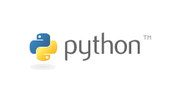

## Python基础知识

---

#### 简介
* Python是一门面向对象的解释型计算机设计语言
* 由荷兰人`Guido von Rossum`于1989年的圣诞节发明
* 第一个公开发行版发行与1991年


#### Guido von Rossum


## Python语言特色

---

1. Python是一门解释性语言
    * 解释性语言：在系统中运行时需要使用解释器（如：PHP、Java 等）    
    * 编译性语言：在系统中运行不需要解释器，可以直接运行（如：C、C++ 等）
        ##### 此处对于解释型和编译型语言的个人理解：
        *  很多资料说，C/C++等是编译型语言，而Java、C#、Python、JavaScript都是解释型语言，是通过解释器来实现的，其实这么说很容易引起误解：语言一般只会定义其抽象语义，而不会强制性要求采用某种实现方式，例如说C一般被认为是编译型语言，但C的解释器也是存在的，例如Ch......所以一般称为“解释型语言”的是主流实现方式为解释器的语言，但并不是说它就无法编译。

1. 弱类型语言
    * 弱类型语言：变量在使用之前不需要提前声明变量的类型就可以直接使用
    * 强类型语言：变量在使用之前需要提前声明变量的类型
        ##### 此处对于Python语言的强和弱的个人理解：
        * python的强体现在3版本中不同类型之间不能进行运算
        * python的弱就是体现在无需声明变量就可以直接使用
1. 面向对象的语言
    * Python支持面向对象的编程，也在一定程度上支持面向过程和面向函数
        ##### 此处对于面向对象的个人理解：
        * 面向对象：其中对象是指一系列数据（属性），以及一套访问和操作这些数据的方法
        * 它是相对于面向过程来说的。举个栗子，你开车去上班。以我们以前多年的思维来思考的话，可以这样理解：你开着自己的车子从路上去向公司。这期间可以杂糅成功一个整体，最终目的就是到达公司上班，要是让你计算耗费时间的话，在理论情况下只需要知道车的平均行驶速度和总路程即可。这就是所谓的面向过程，我们只需要往最后结果上去靠就行了，其中还是我们人脑进行各种逻辑推到和演算。
        * 而面向对象恰恰相反！还是这个例子。依照面向对象的思想来看，可以至少分为3个对象：人，车，目的地。谁去公司上班？谁怎么去公司上班？谁怎么去哪家公司上班？这样处理的好处在于可以计算重复性问题，而不用来一个人我还得再计算一遍。其中“人”可以是你，我，他。交通工具可以是自行车，汽车，公交车。而每个人的公司地址有都不一样。最终我们要计算耗费时间的话只需要找到交通工具的速度属性，以及目的地的距离属性，让交通工具以这样的速度自己去行驶那样的距离就可以了，最终得到的结果是自然而然产生的，不用我们去进行所谓的“计算”。我们只需要给出思路即可。
        * 面向对象有3大特点。封装，继承和多态
            * 封装：就是把具体功能像一个黑箱一样装起来，开发人员只需要会“使用”即可，并不需要理解其内部的工作原理，从而实现对外部隐藏有关对象工作原理的细节;
            * 封装又可分为私有化的封装、受保护的封装和公开的封装
            * 继承：比如我们写完一个动物类之后，该类所具有的的相关属性和方法，比如：体重，身高等属性以及吃饭，说话等方法。当我们需要再创建另一个dog类的时候，我们完全不需要重新再创建，只需要继承自这个动物类即可，而且还可以重写原来的属性或者方法，也可以原先不具有的属性或者方法
            * 继承就可分为单继承、多继承和菱形继承等
            * 多态：就是可以对不同类型的对象执行相同条件的操作，即满足我所定义的这一个类可以是多种形态
            * 举个例子：动物类，可以是小狗，也可以是小猫，都满足。
1. 胶水语言
    * Python能够把其他语言（尤其是 C 和 C++ ）编写的各种模块很轻松的联合在一起，另外Python语言本身和扩展库大部分都由 C 语言构建

## Python应用领域

---

#### Python的应用领域非常广：
- Web应用开发，自动化运维，网络爬虫，大数据分析，图像处理，科学计算，游戏，桌面软件，人工智能等等
- 目前业内几乎所有大中型互联网企业都在使用Python，如：Youtube、豆瓣、知乎、Google、Yahoo!、Facebook、百度、腾讯、美团等

**PYPI编程语言流行榜**

依据GOOGLE搜索排名：http://pypl.github.io/PYPL.html

**TIOBE编程语言排行榜 TOP榜单**

综合排名：https://www.tiobe.com/tiobe-index/

截止2018年10月10日，Python在OOGLE搜索排名中占比24.72 %	,高居榜首

## Python的优势

---

1. 简单
    ```
    Python是一种代表简单主义思想的语言
    阅读一个良好的Python程序就像是在读英语,使你能够专注于解决问题而不是去搞明白语言本身
    ```
1. 易学
    ```
    Python极其容易上手，因为Python有极其简单的说明文档
    ```
1. 速度快
    ```
    因为Python崇尚优美、清晰、简单，所以实现相同功能，使用的代码量要比其他绝大多数语言简洁的多
    一般就是指代码量比较少,所以python的开发速度相对较快，python的运行速度相对一般
    ```
1. 免费、开源
    ```
    Python是FLOSS（自由/开放源码软件）之一。FLOSS是基于一个团体分享知识的概念
    使用者可以自由的发布这个软件的拷贝、阅读它的源代码、对它做改动、把它的一部分用于新的自由软件中
    ```
1. 高层语言
    ```
    用Python语言编写程序的时候无需考虑诸如如何管理你的程序使用的内存等底层细节
    这里的高低指的是距离硬件的远近，python距离硬件相对比较远
    ```
1. 可移植性
    ```
    由于它的开源本质，Python已经被移植在许多平台上（经过改动它能够工作在不同平台上）
    python在linux，windows，mac os都可以使用
    ```
1. 可扩展性
    ```
    如果希望关键代码运行的更快或某些算法不公开，可以部分程序使用C或C++编写，然后在Python程序中使用它们
    ```
1. 可嵌入性
    ```
    可以把Python嵌入到 C 或 C++ 程序中，从而向程序用户提供脚本功能
    ```

