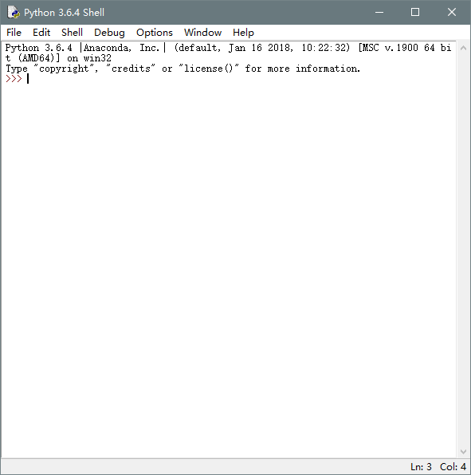

Windows 安装 Python 3
===

---

> 目前Python有两个大版本，分别是 2.X 和 3.X ，截止于2018年10月10日，python最新版本为 3.7.0。 但是由于anaconda等某些功能不兼容3.7.0，所以目前还是使用3.6版本。首先我们需要获取Python的安装包，可以从官网获取，如果你因为没有VPN工具而无法访问官网的话，我已经将它放在网盘了，永久有效。

[从官网获取](https://www.python.org/downloads/)or[百度网盘](https://pan.baidu.com/s/1eRYKVFs#list/path=%2F)


你可以根据电脑的操作系统来选择相应的版本。


双击安装，请务必将下面的add python 3.6 to path 选中。


安装成功后直接close即可


好了，到这里就已经安装成功啦

你可以通过 开始 -> 所有程序 -> python 3.6 -> IDLE 打开程序自带的命令行工具


程序自带的命令行界面



或者，你也可以通过 win+R 打开运行窗口， 输入 cmd 回车打开命令行界面，然后输入python命令 回车，也可进入python的交互模式


如果你还是忘记了勾选添加环境变量的话，请手动配置环境变量
> 把安装的Python程序的路径粘贴，复制到我的电脑->属性->高级系统设置->环境变量->Path选项
> 如果需要，win7分隔符使用英文的分号(;)即可，win10直接新建即可，如下图


Python版本检测
===

---

1. 方法一：在cmd中直接输入python，第一行会显示python的当前版本
    ```bash
    Python 3.6.4 |Anaconda, Inc.| (default, Jan 16 2018, 10:22:32) [MSC v.1900 64 bit (AMD64)] on win32
    Type "help", "copyright", "credits" or "license" for more information.
    >>>
    ```
1. 在命令行界面输入 python -V即可，无需进入交互界面即可查看版本信息。
    ```bash
    C:\Users\Administrator>python -V
    Python 3.6.4 :: Anaconda, Inc.
    >>>
    ```
1. 在Windows的开始菜单，打开Python的IDLE，也可以查看到版本信息。（IDLE是Python软件包自带的一个集成开发环境，初学者可以利用它方便的创建、运行、测试和调试Python程序）
    ```bash
    Python 3.6.1 (v3.6.1:69c0db5, Mar 21 2017, 17:54:52) [MSC v.1900 32 bit (Intel)] on win32
    Type "copyright", "credits" or "license()" for more information.
    >>>
    ```
