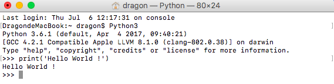
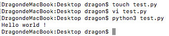
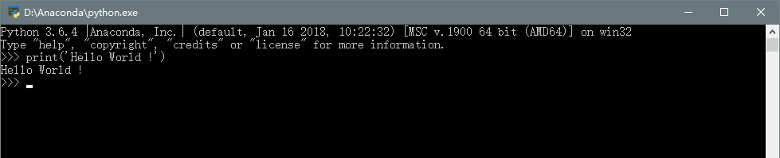
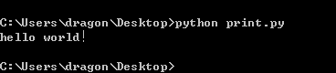

Mac系统 & Linux系统
===

---

### 1.命令行输入

`Python3` (这里我们以Python3版本为主) 命令进入交互模式，输入:

```python
print('Hello World !')
```

**输出结果如下**




### 2.文本输入

首先我们需要建一个以.py为后缀名的文件，如`test.py`。 使用print()输出你想输出的代码，在文件中输入如`print('hello world！')`
运行你的第一个Python程序，在命令行输入命令：`python3 test.py`



Windows系统
===

---

### 1.命令行输入

windows + R：再输入python，即可进入交互模式

```python
print('Hello World !')
```

**输出结果如下**



### 2.文本输入

首先我们需要建一个以.py为后缀名的文件，如`test.py`。 使用print()输出你想输出的代码，在文件中输入如`print('hello world！')`
运行你的第一个Python程序，在命令行输入命令：`python3 test.py` 
**注意： 这里要留意路径问题，在终端进入到要运行的.py所在文件夹。**

**输出结果如下**


