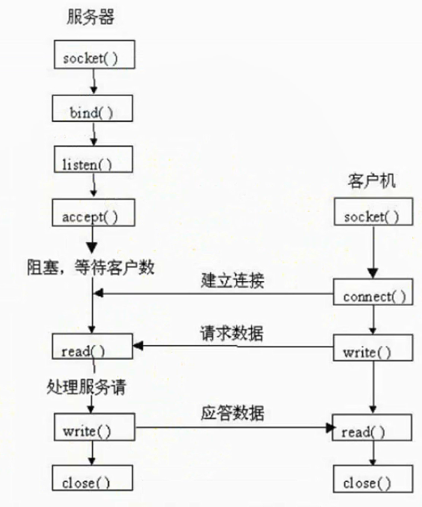

TCP编程
===

---

* ## TCP通信过程

    

---

* ## TCP三次握手和四次挥手

* #### 三次握手
1. 第一次握手：Client将标志位SYN置为1，随机产生一个值seq=x，并将该数据包发送给Server，Client进入SYN_SENT状态，等待Server确认；
1. 第二次握手：Server收到数据包后标志位SYN=1知道Client请求建立连接，Server将标志位SYN和ACK都置为1，ack=x+1，随机产生一个值 seq=y，并将该数据包发送给Client以确认连接请求，Server进入SYN_RCVD状态；
1. 第三次握手，Client收到确认后，检查ack是否为x+1，ACK是否为1,如果正确则将标志位ACK置为1，ack=y+1，并将该数据包发送给Server，Server检查ack是否为y+1，ACK是否为1，如果正确则连接建立成功，Client和Server进入ESTABLISHED状态，**完成三次握手，随后Client与Server之间可以开始传输数据了**。
1. 查看是否有SYN攻击：
    * `$netstat -nap | grep SYN_RECV`


* #### 四次挥手
1. 第一次挥手：Client发送一个FIN，用来关闭Client到Server的数据传送，Client进入FIN_WAIT_1 状态；
1. 第二次挥手：Server收到FIN后，发送一个ACK给Client，确认序号为收到序号+1（与SYN相同，一个FIN占用一个序号），Server进入CLOSR_WAIT状态；
1. 第三次挥手：Server发送一个FIN，用来关闭Server到Client的数据传输，Server进入LAST_ACK状态；
1. 第四次挥手：Client收到FIN后，Client进入TIME_WAIT状态，接着发送一个ACK给Server，确认序号为收到的序号+1，Server进入CLOSED状态，完成四次挥手


* ### TCP报文
1. 序号：Seq序号，占32位，用来标识从TCP源端发送的字节流，发送方发送数据对此进行标记
1. 确认好：Ack序号，占32位，只有ACK标志位为1时，确认序号字段才有效，Ack=Seq+1
1. 标志位 6个
```py
A. URG: 紧急指针(urgent pointer)有效
B. ACK: 确认序号有效
C. PSH: 接收方应该尽快将这个报文交给应用层
D. RST: 重置连接
E. SYN: 发起一个新连接
F. FIN: 释放一个连接
```
---

* ## TCP服务端搭建

    ```py
    1、导入模块
        import socket
    2、创建socket对象
        sock = socket.socket(socket_family, socket_type)
            socket_family:
                socket.AF_INET      通用网络协议的传播 ipv4
                socket.AF_INET6                       ipv6
                socket.AF_LNIX      使用与UNIX系统内部的传输
            socket_type:
                socket.SOCK_STREAM  TCP协议
                socket.SOCK_DGRAM   UDP协议
    3、绑定ip和端口号
        sock.bind(("ip", 端口号))  ip地址可以为空，如果为空，表示绑定所有ip
    4、设置监听
        sock.listen(5)
    5、接收信息
        con, add = sock.accept()
            con：接收sock对象，接收对方发送的信息
            add：接收ip和端口号
        print(con.recv(1024))
    6、关闭套接字
        socket.close()
    ```


* ## TCP客户端搭建

    ```py
    1、导入模块
        import socket
    2、创建socket对象
        # 参数：是一个元组，第一个元素为要连接的服务器的IP地址（域名也行），第二个参数为端口号
        sock = socket.socket(socket_family, socket_type)
        这两个参数必须和服务端保持一致
    3、连接服务器
        sock.connect(("服务器的ip地址", 端口号))
    4、发送信息
        sock.send("要发送的信息")
        print(sock.recv(1024))
    5、关闭套接字
        sock.close()
    ```

---

实例
===

* ### TCP服务端搭建

    ```py
    # -*- coding:utf-8 -*-

    import socket

    tcpServer = socket.socket(socket.AF_INET, socket.SOCK_STREAM)

    tcpServer.bind(("", 8000))

    tcpServer.listen(5)
    print("TCP服务器已开启......")

    a = 0
    while a == 0:
        con, add = tcpServer.accept()
        print("con: {}".format(con))
        print("add: {}".format(add))
        print("{}已经连接成功......".format(add[0]))
        while True:
            recvs = con.recv(1024)
            print(recvs.decode("utf-8"))
            if recvs.decode("utf-8") == 'q':
                print("与客户端断开连接......")
                print("TCP服务器开启中......")
                break

            data = input(">>>")
            con.send(data.encode("utf-8"))
            if data == 'q':
                a = 1
                break

    tcpServer.close()
    ```


* ### TCP客户端搭建

    ```py
    # -*- coding:utf-8 -*-

    import socket

    tcpClient = socket.socket(socket.AF_INET, socket.SOCK_STREAM)

    tcpClient.connect(("10.15.107.14", 8000))
    print("已成功连接到服务器......")

    while True:
        data = input(">>>")
        tcpClient.send(data.encode("utf-8"))
        if data == 'q':
            break

        recvs = tcpClient.recv(1024)
        print(recvs.decode("utf-8"))
        if recvs.decode("utf-8") == 'q':
            break
    tcpClient.close()
    ```


