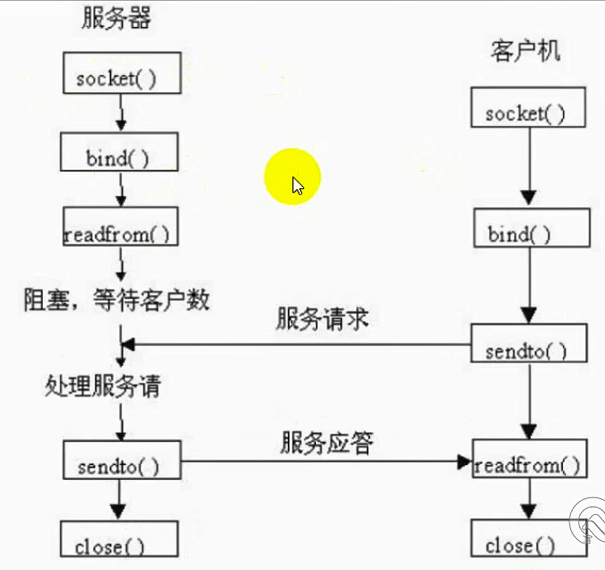

UDP协议
===

---

* ## TCP通信过程

    


---

* ## UDP服务端搭建

    ```py
    # -*- coding:utf-8 -*-

    import socket
    import time

    udpServer = socket.socket(socket.AF_INET, socket.SOCK_DGRAM)

    udpServer.bind(("", 8000))
    print("UDP服务器已开启......")

    a = 0
    while a == 0:

        while True:

            con, add = udpServer.recvfrom(1024)
            print(add[0], "已经成功连接...")
            if con.decode("utf-8") == 'q':
                print("与一个客户端断开连接......")
                print("UDP服务器开启中......")
                break
            print(con.decode("utf-8"))

            data = input(">>>")
            udpServer.sendto(data.encode("utf-8"), add)
            if data == 'q':
                print("正在关闭UDP服务器，请稍后...")
                time.sleep(1)
                print("已关闭...")
                a = 1
                break

    udpServer.close()
    ```

* ## UDP客户端搭建

    ```py
    # -*- coding:utf-8 -*-

    import socket
    import time

    udpClient = socket.socket(socket.AF_INET, socket.SOCK_DGRAM)

    udpClient.bind(("", 8001))
    print("已成功连接UDP服务器......")

    while True:
        data = input(">>>")
        udpClient.sendto(data.encode("utf-8"), ("127.0.0.1", 8000))
        if data == 'q':
            print("正在断开连接，请稍后...")
            time.sleep(1)
            print("已断开...")
            break

        info = udpClient.recv(1024)
        if info.decode("utf-8") == 'q':
            break
        print(info.decode("utf-8"))

    udpClient.close()
    ```


