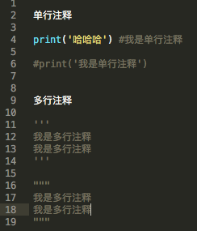
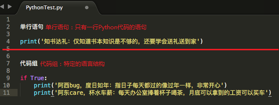

注释
===

---

### 定义：

* 即注解，解释。分为单行注释和多行注释
    1. 单行注释： 单行注释以 `#` 号开头，在当前行内，`#` 号后面的内容就是注释内容
    1. 多行注释： 多行注释使用两个 `'''` 或两个 `"""` 将需要注释的内容包裹起来
    1. 多行注释中可以使用另一种多行注释。如：在`'''` 中可以使用`"""`，在 `"""` 中可以使用 `'''`

### 作用：

1. 给代码做出标注，进行解释和说明。方便别人阅读和理解代码
1. 在debug的时候，可以通过注解来一行一行查找问题

Python 语句分类
===

---

#### Python语句分为两类：单行语句 和 代码块/代码组
* 单行语句指的是一行Python代码。
* 代码组指的是特定的语言结构(标志是`冒号`和`缩进`)。

