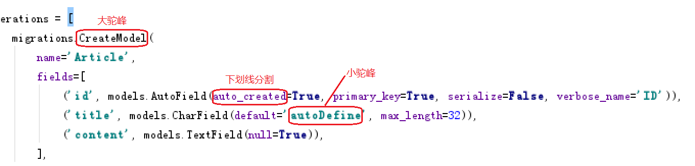

常用命名方式
===

---

> 不管是文件，变量，函数或类名等等，命名都要遵守一个基本规范，就是，命名要有意义，易读易懂。因此，两种主流的命名方式出现了，他们分别是驼峰命名方法 和 使用下划线分隔的方式

### 驼峰命名

驼峰命名法还细分为两种：

* 小驼峰式命名法
    * 第一个单词首字母小写，之后的单词首字母大写，例如：`userInfo、goodsList、articleList`
* 大驼峰式命名法
    * 每个单词的首字母都使用大写字母，例如：`UserCenter、DataInfo`

### 下划线分隔命名

就是使用下划线_连接所有的单词，以便区分。如：

    user_info   和   data_list

图解



### 变量的命名规范

1. 可以使用中文，但是python大神都不用
1. 可以使用数字，但是数字不能在开头
1. 变量名称只能使用数字、字母和下划线
1. 开头可以使用下划线，但其有特殊含义，一个下划线开头表示该变量很重要，请勿随意修改，两个下划线开头表示私有变量
1. 严格区分大小写
1. 变量名称要具有描述性
1. 不能使用关键字当做变量名

关键字
===

---

> 关键字就是一些具有特殊功能的标识符。在这里关键字指的是系统已经使用了的标识符，那么系统一般是不允许我们使用跟这些关键字同名的标识符的。

查看系统保留关键字的方法：

> 在命令行输入 import keyword 回车后输入 print(keyword.kwlist) 即可查看。

目前系统保留关键字有：

```python
import keyword

print(keyword.kwlist)

D:\Anaconda\python.exe F:/python/数据分析/day1010/demo1.py
['False', 'None', 'True', 'and', 'as', 'assert', 'break', 'class', 'continue', 'def', 'del', 'elif', 'else', 'except', 'finally', 'for', 'from', 'global', 'if', 'import', 'in', 'is', 'lambda', 'nonlocal', 'not', 'or', 'pass', 'raise', 'return', 'try', 'while', 'with', 'yield']

Process finished with exit code 0
```

创建Python文件
===

---

#### 文件名称部分

1. 可以使用中文，但是python大神都不用
1. 可以使用数字，但是数字不能在开头
1. 变量名称只能使用数字、字母和下划线
1. 开头可以使用下划线，但其有特殊含义，一个下划线开头表示该变量很重要，请勿随意修改，两个下划线开头表示私有变量
1. 严格区分大小写
1. 变量名称要具有描述性
1. 不能使用关键字当做变量名

#### 文件后缀部分

    Python不限制文件后缀名，但建议使用更标准的常用格式
    常用文件后缀：   .py    .pyw 
    .pyw 格式是被设计来运行开发完成的纯图形界面程序的
    但在开发纯图形界面程序的时候，你也可以暂时把 .pyw 改成 .py，方便运行时调出控制台的窗口，查看所有错误信息

如：


#### 查看文件后缀的方法

    win7    
    打开任意文件夹->组织选项->文件夹和搜索选项->查看选项卡->高级设置->取消"隐藏已知文件类型的扩展名"选项

    win10   
    打开任意文件夹->查看选项卡->倒数第三列中第二个选项(文件扩展名)勾上去

