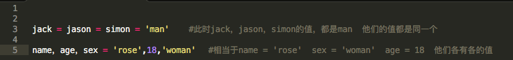

变量
===

---

### 定义

* 变量就是可以变化的量（在Python中更像是把变量的值贴到值上面，之后使用这个值就直接用贴在它上面的名字即可），如：

```python
x + y = 10
x = 5    y = ?
x = 7    y = ?

# 上面示例中的 x 和 y 就是变量，它们是数学里的变量。
```

通俗的理解：

    变量       =  生活中的容器(盒子)
    变量赋值操作 = 我们把物品放入盒子
    数据类型    =  放了不同物体的盒子(放了鞋子，那这个盒子的类型就是鞋盒；放了饭，就是饭盒...)

---

### 变量赋值


* 基本格式
    * 变量名 = 值          如：age = 18
* 给多个变量赋相同的值
    * 变量1 = 变量2 = 变量3 ... = 值
* 给多个变量赋不同的值
    * 变量1，变量2，变量3 = 值1，值2，值3



---

### 变量交换

```python
tmp = 变量1
变量1 = 变量2
变量2 = tmp

# 上面方式的简写
变量1,变量2 = 变量2，变量1
```

---

### 变量的三个常用操作

* 获取变量值：直接通过变量名获得即可
    * 用法：name
* 查看数据类型， 使用type()函数
    * type（）
	print（type（变量））
    * isinstance（）-------> isinstance（查看的变量，类型）  返回的值是bool True or False
        print（isinstance（4，int））
* 获取变量在内存中的id标识，使用id()函数
    * 用法：id(name)
