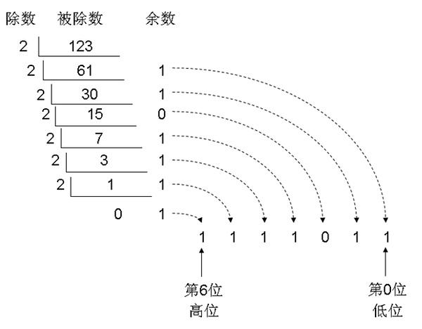
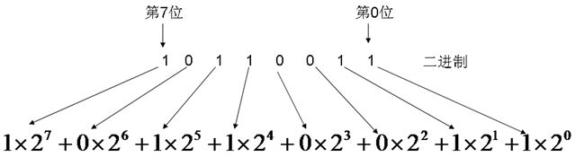
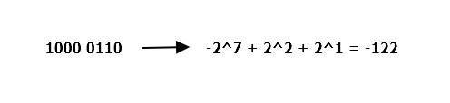

数据类型
===

---

Python中可以自定义数据类型,可以具有无限种数据类型。 系统默认提供6个标准数据类型：

    1.Number类型          数值类型
    2.String类型          字符类型
    3.List类型            列表类型
    4.Tuple类型           元组类型
    5.Dict类型            字典类型
    6.Set类型             集合类型

在Python中我们不需要声明一个变量的数据类型，只需要定义它并为它赋值，因为系统会根据我们给它的值自动分辨它的数据类型。

* Number中包含： int、float、bool、complex
* 容器数据类型： String、List、Tuple、Set、Dict
* 有序数据类型： String、List、Tuple
* 无序数据类型： Set、Dict

---

## Number类型

Number类型一共分为四个小类别：int(整型)、float(浮点型)、bool(布尔型)、complex(复数)

---

### int 整形

整形就是整数类型，声明整形有四种方式：

```bash
1.十进制：0~9
    变量 = 十进制数字

2.二进制：0~1
    变量 = 0b二进制数字
    0b是二进制的标志符号

3.八进制：0~7
    变量 = 0o八进制数字
    0o是八进制的标志符号

4.十六进制：0~9A~F
    变量 = 0x十六进制数字
    0x是十六进制的标志符号
```

整数分为：正整数、负整数和0

#### 关于负数取余的问题
* 两个数取余
    * 若其中两个数的符号（+-号）相异，则取得的商的绝对值要稍大于除数，且与除数符号相同，然后再用除数减去商得到余数；
    * 若其中两个数的符号（+-号）相同，则取得的商的绝对值要稍小于除数，且与除数符号相同，然后再用除数减去商得到余数。

    ```python
    print(15 % 4)		# 3
    print(15 % -4)		# -1
    print(-15 % 4)		# 1
    print(-15 % -4)		# -3

    print(5 % 6)		# 5
    print(5 % -6)		# -1
    print(-5 % 6)		# 1
    print(-5 % -6)		# -5
    ```

#### 关于2进制数符号位的问题

>0110  十进制为6
对于-6，其符号位要是在第四位，即1110原码的话，其按照取反在取补再求真值，其结果也为-6，但是要是把-6和-24进行按位与运算，-24的符号位在第八位，-6的符号位要是还在第四位，两个数的符号位不在同一位，进行运算就会出错，所以这时就要把-6的二进制符号位写到第八位，即1000 0110的形式才可以。
-6的二进制形式，写成 1110 或者1000 0110都可，关键是按位运算时，和其进行运算的数的符号位在第几位，两者取大值即可
ps:其实上Python是取4字节，一个字节占8位，共32位，但是负数会超过32位，使用时需要和0xFFFFFFFF进行与(&)操作来控制位数

#### 关于进制转换的问题

* **十进制转二进制**
    * 口诀：除以2取余，再由下往上读出，如下图：
    

* **二进制转十进制**
    * 位数的值乘以位数减1次方，如下图：
    

* **八进制转二进制**
    * 例：345 ，先将每一位转换成三位二进制数
    * 3 --> 011, 4 --> 100, 5--> 101
    * 最后将这三个三位二进制数拼在一起为：011 100 101

* **二进制转八进制**
    * 例：010110101， 从右往左，先将每三位看成一个整体，不足补0
    * 取每一个三位数的八进制数，再组合在一起
    * 010 --> 2, 110 --> 6, 101 --> 5
    * 最终为转换成的二进制数为：265

* **十六进制转换为二进制**
    * 例：9B7，先将每一位转换成四位二进制数
    * 9 --> 1001, B --> 1011, 7 --> 0111
    * 最后将这三个四位二进制数拼在一起为：1001 1011 0111

* **二进制转换成十六进制**
    * 例：100 0101 0100，从右往左，每四位放在一起，不足补0
    * 0100 --> 4 (此处只有三位，所以补了0), 0101 --> 5, 0100 --> 4
    * 最终为转换成的二进制数为：454

#### 原码、反码、补码

* **机器数和真值**
    * **机器数**
        * 一个数在计算机中的二进制表示形式,  叫做这个数的机器数。
    * **真值**
        * 机器数的实际值称为真值。
    * **符号数和无符号数**
        * 符号数和无符号数是针对符号出现的两种机器数表示方法。同一个二进制数，对符号数和无符号数具有不同的含义。

        * 符号数如：    char, short ,int, long等类型的变量

        * 无符号数如：unsigned char, unsigned short , unsigned int, unsigned long, 指针等类型的变量
    * **定点数与浮点数**
        *  定点数和浮点数是针对小数点出现的两种机器数表示方法。
* **原码, 反码, 补码的基础概念和计算方法**
    只有符号数才有原码, 反码, 补码

    在探求为何机器要使用补码之前, 让我们先了解原码, 反码和补码的概念.对于一个数, 计算机要使用一定的编码方式进行存储. 原码, 反码, 补码是机器存储一个具体数字的一种编码方式.

    * **原码**

        ```bash
        原码就是符号位加上真值的绝对值, 即用第一位表示符号, 其余位表示值. 比如如果是8位二进制:

        [+1]原 = 0000 0001

        [-1]原 = 1000 0001

        第一位是符号位. 因为第一位是符号位, 所以8位二进制数的取值范围就是:

        [1111 1111 , 0111 1111]

        即

        [-127 , 127]
        ```
    * **反码**

        ```bash
        反码的表示方法是：正数的反码是其本身,负数的反码是在其原码的基础上, 符号位不变，其余各个位取反.

        [+1] = [00000001]原 = [00000001]反

        [-1] = [10000001]原 = [11111110]反

        可见如果一个反码表示的是负数, 人脑无法直观的看出来它的数值. 通常要将其转换成原码再计算.
        ```
    * **补码**

        ```bash
        补码的表示方法是：正数的补码就是其本身

        负数的补码是在其原码的基础上, 符号位不变, 其余各位取反, 最后+1. (即在反码的基础上+1)

        [+1] = [00000001]原 = [00000001]反 = [00000001]补

        [-1] = [10000001]原 = [11111110]反 = [11111111]补

        对于负数, 补码表示方式也是人脑无法直观看出其数值的. 通常也需要转换成原码在计算其数值
        ```
        * **根据补码求真值**
            * 直接将各位数的位数减一次方相加
            * 有符号位就在最高位加上 `-`号，如下图：

            


* **为何要使用原码, 反码和补码**

    * 使用补码，可以将符号位和其它位统一处理；同时，减法也可按加法来处理。
    * 使用补码, 不仅仅修复了0的符号以及存在两个编码的问题, 而且还能够多表示一个最低数. 这就是为什么8位二进制, 使用原码或反码表示的范围为[-127, +127], 而使用补码表示的范围为[-128, 127].
        ```
        (-1) + (-127) = [1000 0001]原 + [1111 1111]原 = [1111 1111]补 + [1000 0001]补 = [1000 0000]补
        ```
* **对原码、反码、补码的个人理解**

    * 计算机世界突然出现了正负之分，但是正负相加不等于0，而是等于其他的一个数，所以出现了反码，使正负相加等于0，但是是-0，所以又出现了补码，使得最后结果去掉最高位得到唯一的一个“正0”。

---

### float 浮点型

浮点型就是小数类型，声明浮点型有两种方式：

```python
1.小数方式：
    变量 = 3.1415926

2.科学计数法：
    变量 = 314e2    #相当于314x10的平方
```

---

### bool 布尔类型

布尔类型是计算机专用的数据类型，只有2个值：True和False

* bool类型只有两个值：True  和 False   （True和False的首字母都要大写！）
* True：表示肯定的，确定的答案
* False：表示否定的答案

---

### complex 复数类型

复数的完整结构(实数部分+虚数部分)

复数定义：由实数部分和虚数部分组成，实数部分是实际存在的数字，虚数部分是现实世界中不存在的数字。在计算机中虚数的单位为j。

声明一个复数的方法：
```python
方法一：
	变量 = a + bj
方法二：
	变量 = complex（实数,虚数）           实数和虚数都只要填入纯数字即可，虚数部分不需要填入单位：j
	如：
	complex1 = complex(3,4)   ==     complex1 = (3 + 4j) 
```

实数：现实存在的所有数值都是实数 虚数：不是真实存在的数字(i的平方为-1作为基本单位) 数学中：i的平方 = -1 i就是虚数的基本单位 1i 2i 5i... 计算机中：用j来表示i即可

---

### String 字符串类型

字符串类型就是文字类型，声明一个字符串类型有三种方式：

    单引号：
        变量 = '内容'

    双引号：
        变量 = "内容"

    三引号：
        变量 = '''内容'''
        变量 = """内容"""

如何选择声明字符串的方式：

    单引号：内容中包含大量双引号时，适合使用单引号声明字符串
    双引号：内容中包含大量单引号时，适合使用双引号声明字符串
    三引号：内容中同时包含单双引号，适合使用三引号声明字符串

转义字符： 通过某种特定的格式使得字符的意义发生改变，这就是转义字符，常见转义字符如下：

    转义字符  作用描述        使用率
    \        续行符           *
    \\       反斜杠符号(\)     ***
    \'       单引号           *****
    \"       双引号           *****
    \a       响铃
    \b       退格(backspace)
    \e       转义
    \000     空
    \n       换行             *****
    \v       纵向制表符
    \t       横向制表符        *****
    \r       回车             *****
    \f       换页
    \oyy     八进制数，yy代表的字符，例如：\o12代表换行
    \xyy     十六进制数，yy代表的字符，例如：\x0a代表换行
    \other   其它的字符以普通格式输出

**原始字符串**： 在任意字符串之前添加字母r或者R，那么当前字符串中所有转义字符在使用时都不会进行转义操作，这就是元字符串，正则表达式中常见格式。

    strval = r'锄禾日当午，\n汗滴\\禾下土，\n谁知\r盘中餐，\n丽丽\t皆辛苦\n'

#### 索引值

* 正向： 从0开始
* 反向：从-1开始
* 变量[index]

---

### List 列表类型

**列表就是一些列数据的顺序组合**，并且组合之后可以修改。 列表的标志符号：`[]` 列表格式：

    变量 = [值,值,值...]

* 创建一个空列表：
    ```python
    方法一：	变量 = []
    方法二：	变量 = list()
    ```

* 列表索引值
    ```python
    正向索引： 0   1   2   3   4
    list1 = [100,200,300,400,500]
    反向索引：-5  -4  -3  -2  -1
    ```

* 通过索引访问和修改列表中特定的值
    ```python
    列表[index]
    列表[index] = 新的值     可以通过下标索引来修改列表中的值
    ```

---

### Tuple 元组类型

**元组就是一些列数据的顺序组合**，但是组合之后**不可以修改**。 元组的标志符号：`,` 

元组格式：

    变量 = （值1，值2，值3，...）
    变量 = 值1，值2，值3...

创建一个空元组：

    变量 = tuple（）
    变量 = （）

索引值查看元组内的数据
    
    正向索引：从左到右，从0开始
    反向索引：从右到左，从-1开始
    通过索引值查看元祖内动值：变量 [index]

元组中的值不能随意修改

---

### Dict 字典类型

**字典就是具有键值映射关系的一组无序数据组合**，可以修改 字典的标志符号：`{}` 
字典格式：

    变量 = {键：值，键：值，键：值。。。}

* 字典是无序数据，无法通过索引来访问其中的某个值

创建一个空字典

```python
变量 = dict()
    dict1 = dict()
变量 = {}
    dict1 = {}
```

字典中通过键来访问值

    变量[键]

---

### Set 集合类型

**一组特定数据的无序组合**，所有数据不会重复 集合的标志符号：无 

集合格式：

    变量 = {值1，值2，值3.。。。}

创建一个空集合

    变量 = set（）

集合是一个无序数据，不能通过index来查看里面的值

---

### 查看数据类型的方法

#### type()

正常工作的时候不能用，因为效率太低了。工作原理是把目标数据和所有数据类型一一匹配询问，找到同目标数据类型相同的类型。

```python
result = type（变量名）
print（result）
```
#### isinstance（）

工作效率比较高，把目标变量和指定的类型做比对，如果目标变量和指定类型为相同类型，则返回True；否则返回False

```python
* 方法一，使用isinstance查看单一类型
	isinstance(变量，类型)
	如：
	var = 123
	result = isinstance(var,int)
	print(result)

* 方法二，使用isinstance查看目标变量是否属于两个类型中
	isinstance（变量，(类型一，类型二)）
	如：
	var = 123
	result = isinstance（var，（int，str））
	print（result）
```
