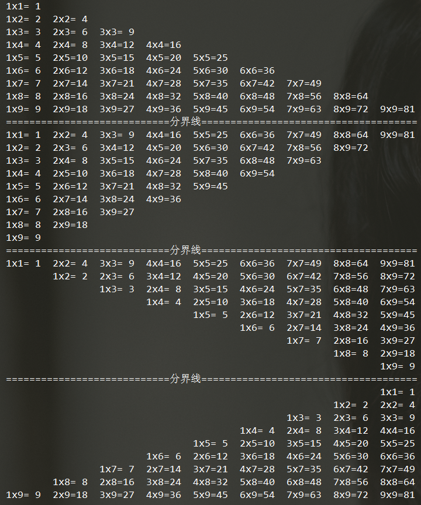

循环结构
===

---

循环结构可以减少源程序重复书写的工作量(代码量)，用来描述重复执行某段算法的问题，这是程序设计中最能发挥计算机特长的程序结构。

Python中循环结构分为两类，分别是 **while** 和 **for .. in**

---
## while 循环

**基本格式:**

```python
while 条件判断:
    条件为真时,执行代码
    ....
```

* 格式1

    ```python
    num1,num2 = 3,5
    while num1 < num2:
        print('如果条件成立，会进入循环体，我所处的这块区域，就是循环体')
        num1 += 1   #控制循环条件中的变量，否则进入死循环
    ```
    * 死循环： 死循环就是循环不会终止的循环类型，设置条件永远为True来实现，但非常占用资源

* 格式2

    ```python
    num1,num2 = 3,5
    while num1 < num2:
        print('如果条件成立，会进入循环体')
        num1 += 1
    else:
        print('条件不成立时，我会被输出')
    ```
    * 注意： while循环中的else是在while条件表达式为假的情况下执行的代码内容

* 一些例题：

    ```python
    # 计算0-100(包含100)所有数之和
    num = 0
    total = 0
    while num <= 100:
        total += num
        num += 1
    print(total)
    
    # 输出十行十列的星星
    i = 0
    while i < 10:
        j = 0
        while j < 10:
            print('✨',end= '')
            j += 1
        print('\n',end='')
        i += 1

    # 使用单循环输出10行10列的星星
    i = 0
    while i < 100:
        print('✨',end = '')
        if i % 10 == 9:
            print()
        i += 1

    # 输出十行十列星星,隔行变色
    i = 0 
    while i < 10:
        j = 0
        while j < 10:
            if i % 2 == 0:
                print('✨',end = '')
            # 隔列变色
            # if j % 2 == 0:
            #    print('✨',end = '')
            else:
                print('❤️',end = '')
            j += 1 
        print()
        i += 1

    # 使用单循环实现隔行变色
    i = 0
    while i < 100:
        if (i // 10) % 2 == 0: 
            print('✨',end = '')
        else:
            print('❤️',end = '')
        if i % 10 == 9:
            print()
        i += 1

    # 输出十行十列星星,交叉变色
    i = 0 
    while i < 10:
        j = 0
        while j < 10:
            if (j % 2 == 0 and i % 2 == 0) or (i % 2 == 1 and j % 2 == 1):
                print('✨',end = '')
            else:
                print('❤️',end = '')
            j += 1 
        print()
        i += 1
    ```

## for ... in

for 变量 in 容器：用于遍历容器类的数据(字符串，列表，元组，字典，集合)

**基本格式:**

```python
for 变量 in 容器:
    循环体
    ...

如：

user_list = ['小明','小红','小强','小军']
for val in user_list:
    print(val)
```

* 遍历除字典外的不等长的二级容器(列表,元组,集合)

    ```python
    for 变量1 in 容器:
        for 变量2 in 变量1:
            循环体
            ...
    ```

* 遍历等长的二级容器

    ```python
    list1 = [
        ['a','b','c'],
        ['d','e','f'],
        ['g','h','i']
    ]
    for x,y,z in list1:
        print(x,y,z)
    ```
    * 要求遍历的容器必须是以下几种格式
        ```
        [(),(),()]    列表中有元组
        [[],[],[]]    列表中有列表
        ((),(),())    元组中有元组
        {(),(),()}    集合中有元组
        ```

* 遍历字典中的键和值:

    ```python
    # 默认遍历键，再根据键打印值
    for key in dict1:
	print(key,dict1[key])
	
    或者
    # 遍历键和值组成元组
    for key,value in dict1.items():
        print(key,value)

    或者
    # 遍历键
    for key in dict1.keys():
        print(key)

    或者
    # 遍历值
    for value in dict1.values():
        print(value)
    ```

* **注意**

    ```python
    data = ('a','b','c','d','e')
    for v in data:
        print(v)
    else:
        print('我else区间又来啦！')
    ```
    * 循环结束时执行else区间的代码，循环若是被中途break或者有返回值，之后的else也不会执行了
    * while 循环也类似

* 一些例题

    ```python
    # -*- coding:utf-8 -*-
    # 九九乘法表的四种形式 for循环

    # 第一种
    for i in range(1, 10):
        for j in range(1, 1+i):
            print("%sx%s=%2s\t" % (j, i, i*j), end="")
        print()

    # 第二种
    for i in range(1, 10):
        for j in range(1, 11-i):
            print("%sx%s=%2s\t" % (j, i+(j-1), (i+(j-1))*j), end="")
        print()

    # 第三种
    for i in range(1, 10):
        for j in range(2, 1+i):
            print("\t\t", end="")
        for j in range(1, 11 - i):
            print("%sx%s=%2s\t" % (j, i + (j - 1), (i + (j - 1)) * j), end="")
    print()

    # 第四种
    for i in range(1, 10):
        for j in range(2, 11-i):
            print("\t\t", end="")
        for j in range(1, 1+i):
            print("%sx%s=%2s  " % (j, i, i*j), end="")
        print()

    ```

    ```py
    # -*- coding:utf-8 -*-
    # 九九乘法表的四种形式 while

    # 第一种
    i = 1
    while i < 10:
        j = 1
        while j < 1+i:
            print("%sx%s=%2s  " % (j, i, j*i), end="")
            j += 1
        print()
        i += 1

    print("===============================分隔符==================================")

    # 第二种
    i = 1
    while i < 10:
        k = 1
        while k < 10-i:
            print("\t\t", end="")
            k += 1
        j = 1
        while j < 1+i:
            print("%sx%s=%2s  " % (j, i, j*i), end="")
            j += 1
        print()
        i += 1

    print("===============================分隔符==================================")
    
    # 第三种
    i = 1
    while i < 10:
        j = 1
        while j < 11-i:
            print("%sx%s=%2s  " % (j, i+(j-1), (i+(j-1))*j), end="")
            j += 1
        print()
        i += 1

    print("===============================分隔符==================================")

    # 第四种
    i = 1
    while i < 10:
        k = 2
        while k < 1+i:
            print("\t\t", end="")
            k += 1
        j = 1
        while j < 11-i:
            print("%sx%s=%2s  " % (j, i+(j-1), (i+(j-1))*j), end="")
            j += 1
        print()
        i += 1
    ```
    

---
## 流程控制语句

### break

```
翻译：破坏，结束
作用：在循环中break的作用是终止当前循环结构的后续所有操作，一旦程序运行了break，循环也就终止了

```
* 如: 输出0-100(包含100)的数字,遇到44则停止循环
    ```python
    i = 0:
    while i <= 100:
        if i == 44:
            break
        print(i)
        i += 1    
    ```

### continue

```
翻译：继续
作用：在循环中continue的作用是跳过本次循环，开始下一次循环。continue执行之后本次循环的后续代码不再执行，直接进入下一次循环。
```
* 如: 输出0 -100(包含100)的数字,遇到任何带4的则跳过
    ```python
    i = 0
    while i <= 100:
        if i % 10 == 4 or i // 10 == 4:
            i += 1
            continue
        else:
            print(i)
            i += 1
    ```

### pass

```
翻译：忽略
作用：pass是没有任何意义的空语句，主要用来占位用，避免语法错误。
```

### input

```
翻译：输入
作用：和用户进行交互式
```
* 如，输入你的名字，输入欢迎语加你的名字

```python
firstName = input('Please input your name:')
print('你好，%s' % firstName)
```

### 状态标识符的运用

```
1. 初始化状态标识
2. 判断格式是否正确
    格式正确，状态标识不变
    格式错误，状态标识改变
3. 判断状态标识是否被改变
    如果状态标识被改变了
        提示格式错误
        初始化状态标识
    如果状态标识未被改变（说明格式正确）
        判断密码是否正确
            密码正确，登陆成功
            break（退出循环）
            密码错误，提示错误，让用户再输入密码
```
* 如：
    ```py
    flag = 1
    sign = True
    ...
    等等
    ```

* 具体代码实例，一个简单的登录操作，其中`islogin `就可以理解为标识符
    ```py
    f = open("user.txt", "r")
    islogin = 0 #判断用户还没有登陆
    login_times = 0 #用户登陆次数
    all = []
    while islogin == 0:
        if islogin == 0:
            # 判断 用户输入三次失败
            if login_times == 3:
                print("登陆三次失败，拜拜~~~")
                break
            else:
                f.seek(0,0)
                name = input("请输入您的用户名:")
                # 获取数据库中的所有用户名和密码
                content = f.readlines()
                for var in content:
                    # 将acount声明为全局变量
                    global acount
                    # 获取所有用户名
                    acount = var.split(":")[0]
                    # 获取所有密码  并且去掉末尾的\n
                    password = var.split(":")[1][:-1]
                    # 判断用户名存在
                    if name == acount:
                        pwd = input("请输入您的密码:")
                        # 判断用户名和密码是否匹配
                        if name == acount and pwd == password:
                            print("登陆成功！")
                            islogin = 1
                            break
                        else:
                            print("您输入的密码不正确，还有%s次机会"%(2-login_times))
                            break
                #判断用户名不存在
                if name != acount:
                    print("用户名不存在！")
            login_times += 1
    f.close()
    ```


