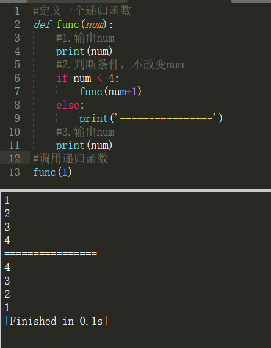

函数 Function
===

---

* **定义**
    * **把具有特定功能的代码打包**就是函数。

* **作用**
    1. 提高代码的复用率
    1. 提高开发效率
    1. 便于程序的维护

* **函数的命名规则**
    1. 可以使用中文，但是python大神都不用
    1. 可以使用数字，但是数字不能在开头
    1. 函数名称只能使用数字、字母和下划线
    1. 开头可以使用下划线，但其有特殊含义，一个下划线开头表示该函数很重要，请勿随意修改，两个下划线开头表示私有函数
    1. 严格区分大小写
    1. 函数名称要具有描述性
    1. 不能使用关键字当做变量名

* **函数声明方式**
    1. **基本格式**
        ```py
        def 函数名():
            pass
        ```
        示例

        ```py
        #定义函数
        def funName():
            pass #此处编写功能代码

        funName() #调用

        '''注释：
        函数的特征：函数定义之后，不会自动执行，只会在调用的时候执行。不调用，不执行。
        '''
        ```
    
    1. **带有参数的格式**

        ```py
        def 函数名(参数1，参数2...):
            pass
        ```
        示例

        ```py
        #定义带有参数的函数
        def funName(arg):
            print('接收到的参数：',arg)

        funName(666) #调用

        '''注释：
        形参：形式上的参数，声明函数时，括号()中的参数，是形参。
        实参：实际上的参数，调用函数是，括号()中的参数，是实参。
        实参将值传递给形参的本质过程，本质上就是简单的变量赋值。
        '''
        ```
    
    1. **带有默认值的参数的格式**

        ```py
        def 函数名(参数1 = 值1,参数2 = 值2...):
            pass
        ```
        示例


        ```py
        #定义带有默认值参数的函数
        def funName(arg = 'jack'):
            print('参数值：',arg)

        funName() #调用方式一
        funName('mark') #调用方式二  调用时传的参数会覆盖默认值

        '''注释：
        如果形参有默认值，调用时可以不需要传参，系统会直接使用参数的默认值。
        调用时给有默认值的参数传参，实参会覆盖形参的默认值。本质上就是变量的重新赋值。
        '''
        ```

    1. **使用关键字参数格式**

        ```py
        def 函数名(形参1 = 实参1,形参2 = 实参2...):
            pass
        ```
        示例


        ```py
        #定义带有默认值参数的函数
        def funName(name = 'jack',age = 18,sex = 'man'):
        print('name:',name)
        print('age:',age)
        print('sex:',sex)

        funName(8,'二狗','Superman') #参数较多时赋值顺序颠倒，将会影响程序执行结果
        funName(age = 8,name = '二狗',sex = 'Superman') #关键字参数赋值完美解决上面的问题

        '''注释：
        关键字参数就是调用函数时，在实参前面指定形参的做法，为了防止参数按照位置传递出现的错误。
        '''
        ``` 

    1. **收集参数使用方法**

        收集参数可以收集的参数不受数量限制

        * **非关键字收集参数**

            ```py
            def 函数名(*参数名):
                pass
            ```
            示例


            ```py
            #定义带有非关键字收集参数的函数
            def funName(*arg):
                for v in arg: #遍历
                    print(v)

            funName(1,2,3,'a','b','c') #调用

            '''注释：
            1.非关键字收集参数，在形参前添加一个*即可
            2.非关键字收集参数，收集的实参会组成一个元组
            3.非关键字收集参数，接受没有任何形参接受的非关键字实参
            4.非关键字收集参数，可以和普通的形参共存
            '''
            ``` 
        
        * **关键字收集参数**

            ```py
            def 函数名(**参数名):
                pass
            ```
            示例

            ```py
            #定义带有关键字收集参数的函数
            def funName(**car):
                for v in car: #遍历
                    print(v,'value : ',car[v])

            funName(a = '卡车',b = '火车',c = '公交车') #调用

            '''注释：
            1.关键字收集参数，在形参前添加两个*
            2.关键字收集参数，收集的实参会组成一个字典，形参名作为键，值作为值
            3.关键字收集参数，仅接收没有任何形参接收的关键字参数
            4.关键字收集参数，可以和普通的形参共存
            '''
            ``` 

        * **多种参数混合使用应当注意**
            * 定义函数时尽量避免多种参数格式混合(普通参数，关键字参数，两种收集参数) 
            * 普通参数和关键字参数必须在两种收集参数之前
            * 非关键字收集参数，必须在关键字收集参数之前
            * 如果多种参数混合在一起用，必须注意禁止参数多次赋值操作(普通参数赋值在前，关键字参数赋值在后

---

## 函数的返回值

* 根据执行函数完毕是否可以得到一个结果，我们可以将函数分为两种类型。
    * **执行过程函数**
        * 函数执行完毕之后，接收不到任何返回结果的函数。如：print()

    * **具有返回值得函数**
        * 函数执行完毕之后，会产生一个结果，可以被接收和使用的函数。如：type()

    格式
    ```py
    def 函数名(参数...):
        Python code...
        return 返回值 #有return的函数，就是有返回值的函数

    变量名 = 函数名(参数...)  #我们可以通过一个变量去接收函数的返回值

    '''注释：
    1.具有return语句的函数，我们称之为具有返回值的函数
    2.return可以为当前函数执行完毕的函数返回一个结果，这个返回值可以用变量接收
    3.return执行之后，函数将会终止，所以return之后的语句是不会被执行的
    4.一个函数可以使用多个return语句，但是只有一个会被执行，一般都是放入分支结构中
    5.一个函数如果需要返回多个数据，使用复合数据类型(list,tuple,set,dict)来操作即可
    '''
    ```

    * **return的作用**
        * 为函数的运行返回一个结果
        * 终止函数执行,一旦函数运行到了return,则在return之后的代码将不会运行

---

## 递归函数

**在函数内调用当前函数本身的函数就是递归函数**

**一个递归函数**

```py
#定义一个递归函数
def func(num):
    #1.输出num
    print(num)
    #2.判断条件，不改变num
    if num < 4:
        func(num+1)
    else:
        print('================')
    #3.输出num
    print(num)
#调用递归函数
func(1)
```

**执行结果**



**分析**

先执行fucn(1),因为参数1<4,所以执行func(2),但是此时的func(1)并没有执行完毕，只是在等待func(2)执行完毕之后再接着执行func(1)剩余的部分。在执行func(2)的过程中又会执行func(3)，接着在执行func(4)，直到func(4)之后不满足条件就打印中间的 `========` 号，再一次执行func(4)、func(3)、func(2)、func(1)剩余的部分就是展示的结果。

```py
# 执行过程分解
func(1)  --> 1 func(2) 1
             1 2 func(3) 2 1
             1 2 3 func(4) 3 2 1
             1 2 3 4 ===== 4 3 2 1
```

* ## 用递归写汉诺塔
    ```py
    def hannoi(n, a, b, c):
        if n == 1:
            print(a, "--->", c)
        else:
            hannoi(n-1, a, c, b)
            print(a, "--->", c)
            hannoi(n-1, b, a, c)
    if __name__ == "__main__":
        hannoi(5, "a", "b", "c")

    a ---> c
    a ---> b
    c ---> b
    a ---> c
    b ---> a
    b ---> c
    a ---> c
    a ---> b
    c ---> b
    c ---> a
    b ---> a
    c ---> b
    a ---> c
    a ---> b
    c ---> b
    a ---> c
    b ---> a
    b ---> c
    a ---> c
    b ---> a
    c ---> b
    c ---> a
    b ---> a
    b ---> c
    a ---> c
    a ---> b
    c ---> b
    a ---> c
    b ---> a
    b ---> c
    a ---> c
    ```


