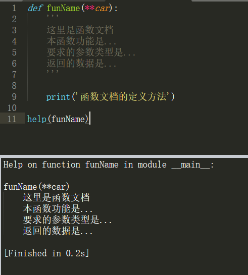

函数文档
===

---

函数文档就是用来查看当前函数相关信息介绍的一个特定格式而已。


## 查看函数文档的方法

* ####  help( ) —help(函数名)

    此方法会直接输出函数文档的内容

    ```py
    help(print)

    help(id)

    help(type)
    ```

* #### 函数名.__ doc __
    直接输出显示函数文档的内容元字符串(可以使用print(函数名.__ doc __)来解决无格式问题)

    ```py
    print.__doc__

    id.__doc__

    type.__doc__
    ```

## 定义函数文档的方法


```py
def 函数名(参数):
    '''
    这里编写函数文档
    '''

    这里编写函数的code...
```

示例：

```py
#定义函数文档的方式
def funName(**car):
    '''
    这里是函数文档
    本函数功能是...
    要求的参数类型是...
    返回的数据是...
    '''

    print('函数文档的定义方法')

help(funName)
#查看函数文档

'''注释：
函数文档的作用是对函数进行说明，便于阅读和快速掌握函数的使用，通常函数文档需要具有以下信息：
1.函数的作用
2.函数的参数介绍(需要几个参数，分别是什么类型)
3.函数的返回值(数据和类型)
'''
```




