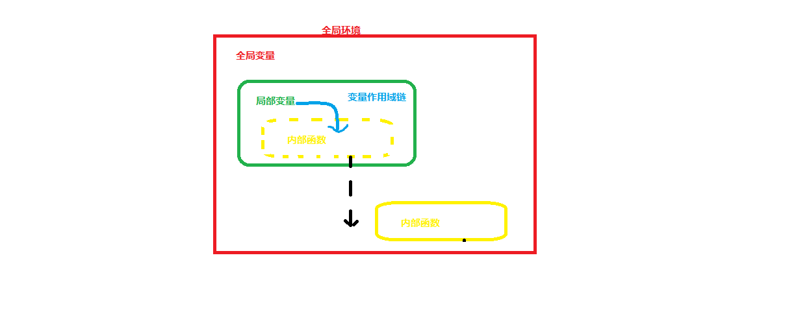
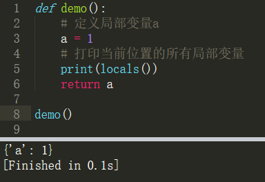
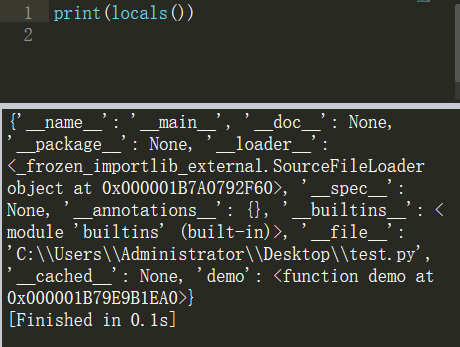

内部函数
===

---

* #### 定义

    在函数内部声明的函数就是内部函数。

* #### 格式

    ```py
    def 函数名():
        局部变量...
        def 内部函数名():
            Python功能代码...
    ```

* #### 示例

    ```py
    def outer():
        name = 'dragon'
        #定义一个内部函数
        def inner():
            print('我是内部函数')

    outer()

    '''注释：
        1.内部函数的本质就是局部变量(函数就是一个变量)
        2.内部函数在函数外部不可以直接调用
        3.内部函数在函数内部调用(当然，必须要定义内部函数之后才能调用)
    '''
    ```

* #### 内部函数的作用域
    * 内部函数不能直接在全局环境中使用,需要使用闭包将它带到全局环境中
    * 在函数内部可以调用内部函数
    * 在函数内部需要先定义内部函数,之后才能调用

---

闭包
===

* #### 定义
    让局部变量和内部函数在函数的外部可以使用

* #### 作用
    让局部变量和内部函数突破局部作用域

* #### 原理

    

* #### 实现方法
    * **方法一：使用global关键字实现闭包**
        ```py
        lists = []

        def func():
            global lists
            
            a = '局部变量a'
            b = '局部变量b'
            
            def inner1():
                print('内部函数inner1')
            def inner2():
                print('内部函数inner2')
            
            lists = [a,b,inner1,inner2]

        func()

        num_a = lists[0]
        num_b = lists[1]
        neibu1 = lists[2]
        neibu2 = lists[3]

        print(num_a)
        print(num_b)
        neibu1()
        neibu2()
        ```
    * **方法二：使用return实现闭包**
        ```py
        def func():
	
            a = '局部变量a'
            b = '局部变量b'
            
            def inner1():
                print('我是内部函数inner1')
            def inner2():
                print('我是内部函数inner2')
            
            return [a,b,inner1,inner2]

        lists = func()

        num_a = lists[0]
        num_b = lists[1]
        neibu1 = lists[2]
        neibu2 = lists[3]

        print(num_a)
        print(num_b)
        neibu1()
        neibu2()
        ```
    * **方法三: 使用return内部函数实现闭包**
        ```py
        def func():
	
            a = '局部变量a'
            b = '局部变量b'
            
            def inner1():
                print('我是内部函数inner1')
            def inner2():
                print('我是内部函数inner2')
            
            def bibao():
                return [a,b,inner1,inner2]
            
            return bibao
            

        result = func()
        lists = result()

        num_a = lists[0]
        num_b = lists[1]
        neibu1 = lists[2]
        neibu2 = lists[3]

        print(num_a)
        print(num_b)
        neibu1()
        neibu2()
        ```

* #### 优缺点

    * 优点
        * 可以方便的进行函数式编程，组织程序代码
        * 使内部函数和局部变量在外部可以访问
    * 缺点
        * 闭包操作会导致整个函数的内部环境，被长久保存，占用大量内存。

---

## locals()函数

* #### locals()函数会以dict类型返回当前位置的全部局部变量

    * 定义一个函数，查看函数内部的局部变量

        

    * 直接打印locals()

        


