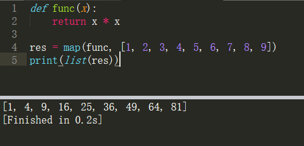
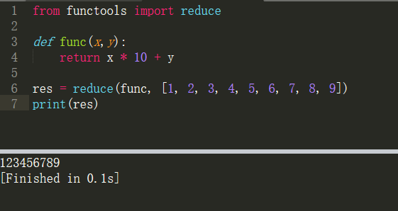
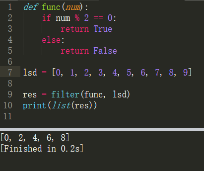
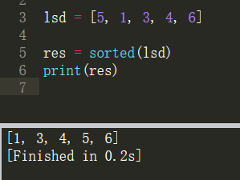
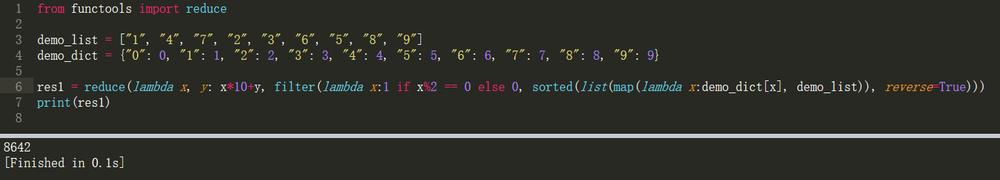
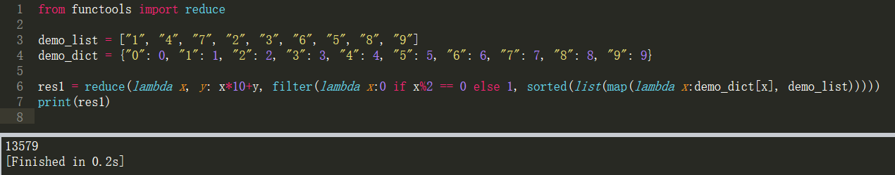

高阶函数
===

----

#### 主要介绍python的4个内置的高阶函数：`map()`、`reduce()`、`filter()`、`sorted()`


---

## map(func, lsd)

* func：可以是一个python内置函数，也可以使我们的自定义函数
* lsd：必须是一个序列，也可以说是一个容器
* 作用：lsd中的元素会依次作用在func上，最终返回一个迭代器

比如我们有一个函数f(x)=x2，要把这个函数作用在一个list [1, 2, 3, 4, 5, 6, 7, 8, 9]上，就可以用map()实现,如下:


```py
def func(x):
    return x * x

res = map(func, [1, 2, 3, 4, 5, 6, 7, 8, 9])
print(list(res))
```


* 注意：map()函数得到的返回值是一个惰性序列(迭代器)，查看时需要转换成容器或者遍历查看

---

## reduce(func, lsd)

* func：是一个函数，此函数必须要有两个参数
* lsd：必须是一个序列，也可以说是一个容器
* 作用：lsd中的前两个元素会作用在func上，然后将得到的结果再和第三个元素执行func，以此类推，直到lsd中没有数据

* **实例**
    ```py
    from functools import reduce

    def func(x,y):
        return x * 10 + y

    res = reduce(func, [1, 2, 3, 4, 5, 6, 7, 8, 9])
    print(res)
    ```

* **结果**

    

---

## filter(func, lsd)

* func：是一个函数，返回bool值
* lsd：必须是一个序列，也可以说是一个容器
* 作用：通过函数判断后面序列作用在前面函数的时候返回的bool值，如果为True，返回这个数值，如果为False，过滤到这个数值，最终也是返回一个**迭代器**

* **实例： 过滤掉0-9中的奇数**
    ```py
    def func(num):
        if num % 2 == 0:
            return True
        else:
            return False

    lsd = [0, 1, 2, 3, 4, 5, 6, 7, 8, 9]

    res = filter(func, lsd)
    print(list(res))
    ```

* **结果**

    

## sorted(lsd)

* lsd：必须是一个序列，也可以说是一个容器
* 作用：用来排序，默认升序

* **实例**
    ```py
    lsd = [5, 1, 3, 4, 6]

    res = sorted(lsd)
    print(res)

    # 还有其他参数，加上reverse=True：就是倒序；key=abs：按绝对值排序
    res = sorted(lsd, reverse=True, key=abs)
    ```

* **结果**

    


---

* ## 例题

有列表["1", "4", "7", "2", "3", "6", "5", "8", "9"]
1. 求出这个列表由所有偶数组成的最大整数

    ```py
    from functools import reduce

    demo_list = ["1", "4", "7", "2", "3", "6", "5", "8", "9"]
    demo_dict = {"0": 0, "1": 1, "2": 2, "3": 3, "4": 4, "5": 5, "6": 6, "7": 7, "8": 8, "9": 9}

    res1 = reduce(lambda x, y: x*10+y, filter(lambda x:1 if x%2 == 0 else 0, sorted(list(map(lambda x:demo_dict[x], demo_list)), reverse=True)))
    print(res1)

    ```

    

1. 求出这个列表由所有奇数组成的最小整数

    ```py
    from functools import reduce

    demo_list = ["1", "4", "7", "2", "3", "6", "5", "8", "9"]
    demo_dict = {"0": 0, "1": 1, "2": 2, "3": 3, "4": 4, "5": 5, "6": 6, "7": 7, "8": 8, "9": 9}

    res1 = reduce(lambda x, y: x*10+y, filter(lambda x:0 if x%2 == 0 else 1, sorted(list(map(lambda x:demo_dict[x], demo_list)))))
    print(res1)
    ```
    

