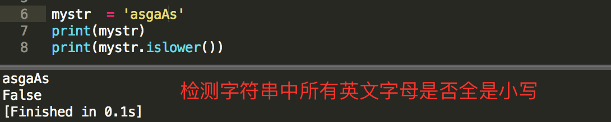

字符串操作
===

---

```bash
+  字符串连接操作
*  字符串复制操作
[] 字符串索引操作，通过索引访问指定位置的字符，索引从0开始
[::] 字符串取片操作
    完整格式：[开始索引:结束索引:间隔值]
    [:结束索引]  从开头截取到结束索引之前
    [开始索引:]  从开始索引截取到字符串的最后
    [开始索引：结束索引]  从开始索引截取到结束索引之前
    [:]  截取所有字符串
    [开始索引:结束索引:间隔值]  从开始索引截取到结束索引之前按照指定的间隔截取字符
r'字符串'   原始字符串，所有字符串中的转义字符不会转义，当作普通字符
```

字符串函数
===

---

* ###  大小写相关

    1. **capitalize()**
        ```py
        功能：首字母大写
        格式：字符串.capitalize()
        返回值：新字符串
        ```
        

    1. **title()**
        ```py
        功能：将每个单词首字母变为大写
        格式：字符串.title()
        返回值：新字符串
        ```
        
        
    1. **upper()**
        ```py
        功能：将所有字母变为大写
        格式：字符串.upper()
        返回值：新字符串
        ```
        

    1. **lower()**
        ```py
        功能：将所有字母变为小写
        格式：字符串.lower()
        返回值：新字符串
        ```
        
    
    1. **swapcase()**
        ```py
        功能：大小写互换
        格式：字符串.swapcase()
        返回值:新字符串
        ```
        

---
* ### 获取长度及出现次数

    1. **len()**
        ```py
        功能：计算字符串的长度
        格式:len(字符串)
        返回值：整型
        ```
        

    1. **count()**
        ```py
        功能：计算指定字符串出现的次数
        格式：字符串.count(查找字符串[开始索引[结束索引]])
        返回值：整数
        ```
        

---

* ### 获取索引值

    1. **find()**
        ```py
        功能：查找指定字符串第一次出现的位置
        格式：字符串.find(查找字符串[开始索引[结束索引]])
        返回值：整数   找不到返回-1
        ```
        

    1. **index()**
        ```py
        功能：查找指定字符串第一次出现的位置
        格式：字符串.index(查找字符串[开始索引[结束索引]])
        返回值：整数   找不到抛出错误！
        ```
        

---
* ### 检测类字符串函数

    1. **startswith()**
        ```py
        功能：检测字符串是否以指定的字符串开头
        格式：字符串.startswith(查找字符串)
        返回值：布尔值
        ```
        

    1. **endswith()**
        ```py
        功能：检测字符串是否以指定的字符串结尾
        格式：字符串.endswith(查找字符串)
        返回值：布尔值
        ```
        
    
    1. **istitle()**
        ```py
        功能：检测字符串是否符合title()的结果
        格式：字符串.istitle()
        返回值:布尔值
        ```
        

    1. **isupper()**
        ```py
        功能：检测一个字符串中的英文是否都是大写字母，符号不算
        格式：字符串.isupper()
        返回值:布尔值
        ```
        

    1. **islower()**
        ```py
        功能：检测一个字符串中的英文是否都是小写字母，符号不算
        格式：字符串.islower()
        返回值：布尔值
        ```
        

    1. **isalnum()**
        ```py
        功能：检测字符串是否由数字，字母和文字等组成
        格式：字符串.isalnum()
        返回值：布尔值  汉字当作普通字符处理，没有标点和特殊字符就是真，空字符串为false
        ```
    1. **isalpha()**
        ```py
        功能：检测字符串是否由字母和文字组成
        格式：字符串.isalpha()
        返回值：布尔值，汉字当作普通字母处理。空字符串为false
        ```

    1. **isdigit()**
        ```py
        功能：检测字符串是否由纯数字组成  十进制
        格式：字符串.isdigit()
        返回值：布尔值
        ```
    1. **isdecimal()**
        ```py
        功能：检测字符串是否是纯数值字符串组成
        格式:字符串.isdecimal()
        返回值：布尔值
        ```

    1. **isnumeric()**
        ```py
        功能：检测字符串是否是数值字符串  数字整数
        格式:字符串.isnumeric()
        返回值：布尔值
        ```
    
    1. **isspace()**
        ```py
        功能：检测字符串是否由空白字符组成
        格式:字符串.isspace()
        返回值：布尔值
        ```
        

---
* ### 切割和拼接

    1. **split()**
        ```py
        功能：将字符串按照指定字符进行切割操作
        格式：字符串.split(切割指定字符串)
        返回值：列表
        ```
        

    1. **splitlines()**
        ```py
        功能：将字符串按照换行位置进行切割操作
        格式：字符串.splitlines([结束符号])
        返回值：列表
        ```
        

    1. **join()**
        ```py
        功能：将列表中的内容按照指定字符连接成一个字符串
        格式:连接字符串.join(列表)
        返回值：字符串
        ```
        

---
* ### 填充类

    1. **zfill()**
        ```py
        功能：在原有字符串长度不足指定长度时，用0填充
        格式:字符串.zfill(指定长度)
        返回值：字符串   不足的长度使用0填满，原来的字符串内容靠右
        ```
        

    1. **center()**
        ```py
        功能：指定字符串长度，并且使得元字符串内容居中，其余位置使用指定字符填充
        格式: 字符串.center(指定长度[，填充字符])
        返回值：字符串  填充字符默认空格，可以指定其他
        ```
        

    1. **ljust()**
        ```py
        功能：指定字符串长度，并且使得元字符串内容靠左，其余位置使用指定字符填充
        格式：字符串.ljust(指定长度[，填充字符])
        返回值：字符串  填充字符默认空格，可以指定其他
        ```

    1. **rjust()**
        ```py
        功能：指定字符串长度，并且使得元字符串内容靠右，其余位置使用指定字符填充
        格式：字符串.rjust(指定长度[，填充字符])
        返回值：字符串  填充字符默认空格，可以指定其他
        ```

---

* ### 清除字符串类

    1. **strip()**
        ```py
        功能：去掉左右2侧的指定字符，默认空格
        格式:字符串.strip([指定字符])
        返回值：字符串
        ```

    1. **lstrip()**
        ```py
        功能：去掉左侧的指定字符，默认空格
        格式:字符串.lstrip([指定字符])
        返回值：字符串
        ```

    1. **rstrip()**
        ```py
        功能：去掉右侧的指定字符，默认空格
        格式:字符串.rstrip([指定字符])
        返回值：字符串
        ```

---

* ### 字符的替换操作

    1. **maketrans() 和 translate()**
        ```py
        maketrans()
            功能：制作用于字符串替换的映射表
            格式: 字符串.maketrans('查找字符','替换字符')    两个字符必须长度相等
            返回值：字典

        translate()
            功能：进行字符串替换操作
            格式：字符串.translate(映射表)
            返回值：替换之后的字符串
        ```
        

---

* ### 字符串编码类

    1. **encode()**
        ```py
        功能：将字符串转换成位模式可识别的编码
        格式:字符串.encode(编码格式)
        返回值：指定格式的编码
        ```

    1. **decode()**
        ```py
        功能：将编码转换成字符串
        格式:字符串.decode(编码格式)
        返回值：字符串
        ```


