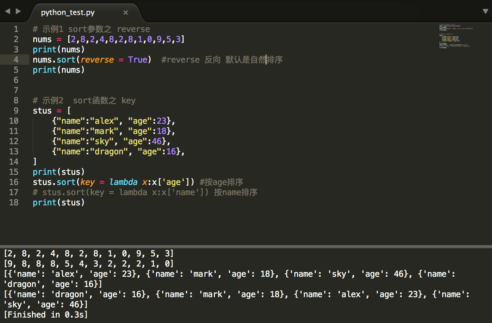

列表
===

---

>一组有序数据的组合就是列表

* ## 列表基本操作

    * 空列表
        ```py
        方式1：
            变量 = []

        方式2：
            变量 = list()
        ```

    * 具有一个数据的列表
        ```py
        变量 = [值]      备注：列表中保存的每个都称之为元素
        ```   

    * 具有多个数据的列表
        ```py
        变量 = [值,值,值....]
        ``` 

    * 访问列表中的元素
        ```py
        变量[索引]

        list1 = ['a','b','c','d']
        print(list1[1])
        ``` 

    * 修改列表中的元素
        ```py
        变量[索引] = 新值

        list1[1] = 'e'
        print(list1[1])
        ``` 

    * 添加列表元素
        ```py
        普通操作无法实现，需要借助函数操作
        append
        insert
        extend
        ``` 

---

* ## 列表的序列操作

        通用的序列操作包括以下几种： 序列相加、序列相乘、索引、取片/分片、成员检测、最大值、最小值、长度计算

    * 列表相加操作
        ```py
        格式：变量 = 列表1 + 列表2
        结果：新的列表
        注意：+两侧都要是列表类型

        list1 = [1,2,3]
        list2 = [4,5,6]
        list3 = list1 + list2
        print(list3)
        ``` 

    * 列表相乘操作
        ```py
        格式：变量 = 列表 * 整数
        结果：新的列表

        list1 = ['a']
        list2 = list1 * 3
        print(list2)
        ``` 

    * 索引操作
        ```py
        变量[索引]
        ``` 

    * 切片操作
        ```py
        格式：变量 = 列表[:]
            获取整个列表

        格式：变量 = 列表[:结束索引]
            获取列表开头到结束索引之前的数据组成的列表（不包含结束索引）

        格式：变量 = 列表[开始索引:]
            获取列表开始索引到列表末尾的数据组成的列表

        格式：变量 = 列表[开始索引:结束索引]
            获取开始索引和结束索引之间的数据组成的列表（包含开始索引，不包含结束索引）

        格式：变量 = 列表[开始索引:结束索引:间隔值]
            获取开始索引和结束索引之间的数据（按照间隔值来获取）组成的列表（包含开始索引，不包含结束索引）
        ``` 
    
    * 成员检测
        ```py
        检测一个数据是否在列表中
            格式：值 in 列表
            结果：布尔值

        检测一个数据是否不在列表中
            格式：值 not in 列表
            结果：布尔值
        ```

    * len() 
        ```py
        格式：len(列表)
        结果：获取列表长度
        ```

    * min()	
        ```py
        格式：min(列表)
        结果：获取列表最小值
        ```

    * max()	
        ```py
        格式：max(列表)
        结果：获取列表最大值
        ```

---

* ## 遍历列表

    * for...in
        ```py
        for 变量 in 列表:
            使用变量
        ```

    * while
        ```py
       i = 0
        while i  <len(列表):
            使用列表中的元素(列表[i])
            i += 1
        ```

    * 遍历同等长度的二级列表
        ```py
        列表 = [[值1,值2],[值1,值2],....]
        for 变量1,变量2 in 列表:
            使用变量1和变量2
        #注意：变量1取二级列表中的第一个值，变量2取第二个值
        ```
    
    * 遍历非同等长度的二级列表
        ```py
        列表 = [[值1，值2]，[值1，值2,值3],[值]...]
        for 变量1 in 列表:
            for 变量2 in 变量1:
                使用变量2(变量2是二级列表中的每个值)
        ```
    * 直接获取二级列表的值
        ```py
        list1[1][3]
        ```

--- 

* ## 列表内涵/列表推导式 list content

    * 普通格式
        ```py
        格式：[变量 for 变量 in 列表]
        结果：遍历列表中的每个值，将每个值获取之后组成新的列表，可以对获取的值进行修改
        [变量可以其他操作 for 变量 in 列表]
        ```

    * 带有判断条件的列表推导式
        ```py
        格式：[变量 for 变量 in 列表  if 条件表达式]
        结果：遍历列表中的每个值，根据判断条件决定是否取出指定的值组成新的列表，可以对获取的值进行修改
        ```

    * 多个列表的同时循环的列表推导式
        ```py
        格式：[变量1+变量2  for 变量1 in 列表1  for 变量2  in 列表2]
        结果：同时遍历列表1和列表2中的每个值，将列表1中的每个值和列表2中的每个值进行运算得到新的列表
            新的列表中元素个数=列表1中元素个数 * 列表2中的元素个数
        变量1和变量2可以进行其他操作，不一定非要+ 这只是demo
        ```

    * 带有判断条件的多个列表的同时循环列表推导式
        ```py
        格式：[变量1+变量2 for 变量1 in 列表1 for 变量2 in 列表2 if 条件表达式]
        结果：同时遍历列表1和列表2中的每个值，根据判断条件将列表1中的值和列表2中的值进行运算，得到新的列表
        新的列表数量由判断条件决定

        list1 = [1,2,3,4,5,6,7,8]
        list2 = [9,10,11,12,13,14]
        list3 = [i + j for i in list1 for j in list2 if list1.index(i) == list2.index(j)]
        print(list3)
        ```

---

* ## 列表专用函数

    1. append()
        ```py
        功能：向列表的末尾添加新的元素
        格式：列表.append(值)
        返回值：None
        注意：新添加的值在列表的末尾，该函数直接操作原有列表
        ```

    1. extend()
        ```py
        功能：将一个列列表继承另一个列表
        格式：列表.extend(序列)
        返回值：None
        注意：直接改变原有列表
        ```

    1. insert()
        ```py
        功能：在指定位置之前插入元素
        格式：列表.insert(索引,值)
        返回值:None
        注意：直接改变原有列表
        ```

    1. clear()
        ```py
        功能：清空列表中所有元素
        格式：列表.clear()
        返回值:None
        ```

    1. pop()
        ```py
        功能：在列表中移除一个元素
        格式：列表.pop([索引])
        返回值：无
        注意：没有指定索引，默认移除最后一个元素
        ```

    1. remove()
        ```py
        功能：移除指定的值
        格式：列表.remove(值)
        返回值：无
        注意：如果有索引的清空下推荐使用POP移除，效率比remove高
        ```
    
    1. count()
        ```py
        功能：计算某个元素出现的次数
        格式：列表.count(值)
        返回值：整数
        ```

    1. index()
        ```py
        功能：获取某个值在列表中的索引
        格式：列表.index(值)
        返回值：整数
        注意：值不存在与列表时抛出异常错误！
        ```

    1. copy()
        ```py
        功能：复制列表
        格式：列表.copy()
        返回值：新的列表
        ```

    1. reverse()
        ```py
        功能：列表反转操作
        格式：列表.reverse()
        返回值：None
        ```

    1. sort()
        ```py
        功能：列表排序

        格式：列表.sort()                      按照从小到大排序（数字）
        格式：列表.sort(reverse=True)          按照从大到小排序（数字）
        格式：列表.sort(key=函数)               对值进行指定的函数处理之后在从小到大排序
        格式：列表.sort(key=函数，reverse=True)  对值进行指定的函数处理之后在从大到小排序

        返回值：None
        注意：直接改变原有列表
        ```

        


---

* ### 赋值、切片[:]、list.copy()、copy.copy、copy.deepcopy

    ```py
    这五种方法都能复制一个列表
    其中：
        赋值：两个列表其中一个改变，都改变
        切片[:]、list.copy()、copy.copy： 这三个效果相同，内层随着改变而改变，外层不会变
        copy.deepcopy：完全不会影响原来的
    ```

    ```py
    import copy

    list1 = [[1,2,3], [4,5,6], 7,8]

    # list2 = list1
    # list2.pop()
    # list2[0].pop()

    # list3 = list1[:]
    # list3.pop()
    # list3[0].pop()

    # list4 = list1.copy()
    # list4.pop()
    # list4[0].pop()

    list5 = copy.copy(list1)
    list5.pop()
    list5[0].pop()

    # list6 = copy.deepcopy(list1)
    # list6.pop()
    # list6[0].pop()

    # print(list2)
    # print(list3)
    # print(list4)
    print(list5)
    # print(list6)

    print(list1)
    ```
