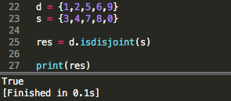

集合
===

---

>确定的无序的一组数据就是集合。
>
>集合中的值不会重复(唯一)
>集合中的元素没有任何顺序
>集合中可以使用整数，浮点数，布尔值，复数，字符串，元组，冰冻集合


* ## 集合的基本操作

    * 创建空集合
        ```py
        变量 = set()
        ```

    * 创建多个数据的集合
        ```py
        变量 = {值,值....}
        注意:集合是唯一性数据，所有相同的数据只会保留一份。
        ```

---

* ## 集合的序列操作

    * 成员检测
        ```py
        值 in 集合
            检测某个值是否存在于集合当中

        值 not in 集合
            检测一个值是否不再集合当中
        ```

    * len() 
        ```py
        格式：len(集合)
        结果：获取集合长度
        ```

    * min()	
        ```py
        格式：min(集合)
        结果：获取集合中最小的值
        ```

    * max()	
        ```py
        格式：max(集合)
        结果：获取集合中最大的键
        ```
---

* ## 集合的遍历

    * 普通遍历
        ```py
        for 变量 in 集合：
            使用变量
        ```

    * 遍历二级集合(等长)
        ```py
        集合 = {（值,值..）,（值，值..）。。。}
        for 变量1，变量2 in 集合：
            使用变量1和变量2
        ```

    * 遍历二级集合(不等长)
        ```py
        集合 = {（值,值..）,（值，值..）。。。}
        for 变量1 in 集合：
            for 变量2 in 变量1:
                使用变量1
        ```

---

* ## 集合内涵/推导式

    * 普通格式
        ```py
        变量={i for i in 集合}
        ```

    * 带有判断条件的集合推导式
        ```py
        变量={i for i in 集合 if 条件表达式}
        ```

    * 多循环推导式
        ```py
        变量 = {i+j for i in 集合1 for j in 集合2}
        ```

    * 带有判断条件的多循环推导式
        ```py
        变量 = {i+j for i in 集合1 for j in 集合2 if 条件表达式}
        ```

---

* ## 集合专用函数

    * ### 集合函数普通操作
        1. add()
            ```py
            功能:向集合中添加一个元素
            格式:集合.add(值)
            返回值：None
            注意：直接改变原有集合
            ```

        1. pop()
            ```py
            功能：随机删除集合中的一个元素
            格式：集合.pop()
            返回值：删除的那个元素
            注意：直接改变原有集合
            ```

        1. remove()
            ```py
            功能：删除集合中的某个指定元素
            格式：集合.remove(值)
            返回值：None
            注意：直接改变原有集合，删除的元素不存在时会报错
            ```

        1. discard()
            ```py
            功能：删除集合中的某个指定元素
            格式：集合.dicard(值)
            返回值：None
            注意：直接改变原有集合，删除的元素不存在时不会报错
            ```

        1. clear()
            ```py
            功能：清空集合
            格式：集合.clear()
            返回值：None
            注意：直接改变原有集合
            ```

        1. copy()
            ```py
            功能：复制集合
            格式：集合.copy()
            返回值：新的集合
            ```

    * ### 集合之间的运算函数

        1. difference() `-`
            ```py
            功能:差集
            格式:集合1.difference(集合2)
            返回值：集合
            操作：获取存在于集合1但是不存在与集合2中的数据的集合
            ```

        1. difference_update()
            ```py
            功能：差集 更新
            格式:集合1.difference(集合2)
            返回值：无 直接将结果赋值给集合1
            操作：获取存在于集合1但是不存在与集合2中的数据的集合
            ```
        
        1. intersection() `&`
            ```py
            功能：交集
            格式：集合1.intersection(集合2)
            返回值：集合
            操作：获取即存在于集合1又存在于集合2中的数据组成的集合
            ```

        1. intersection_update()
            ```py
            功能：交集更新
            格式：集合1.intersection_update(集合2)
            返回值：None  直接将结果赋值给集合1
            操作：获取即存在于集合1又存在于集合2中的数据组成的集合
            ```

        1. union() `|`
            ```py
            功能：交集更新
            格式：集合1.intersection_update(集合2)
            返回值：None  直接将结果赋值给集合1
            操作：获取即存在于集合1又存在于集合2中的数据组成的集合
            ```

        1. update()
            ```py
            功能：并集更新
            格式：集合1.update(集合2)
            返回值：无   直接将结果赋值给集合1
            操作：将集合1和集合2中所有数据新建一个集合(去重)
            ```

        1. issuperset()
            ```py
            功能:检测一个集合是不是另外一个集合的超集
            格式:集合1.issuperset(集合2)
            返回值:布尔值
            ```

        1. issubset()
            ```py
            功能:检测一个集合是不是另外一个集合的子集
            格式：集合1.issubset(集合2)
            返回值：布尔值
            ```

        1. isdisjoint()
            ```py
            功能：检测2个集合是否不相交
            格式：集合1.isdisjoint(集合)
            返回值：布尔值
            ```
            

        1. symmetric_difference() `^`
            ```py
            功能:对称差集操作
            格式：集合1.symmetric_difference（集合2）
            返回值：集合
            操作：将集合1和集合2不相交的部分取出组成的新的集合
            ```

        1. symmetric_difference_update()
            ```py
            功能：对称差集更新操作
            格式：集合1.symmetric_difference（集合2）
            返回值：None 直接将结果赋值给集合1
            操作：将集合1和集合2不相交的部分取出组成的新的集合
            ```

---

* ## 冰冻集合/固定集合 frozenset

        冰冻集合就是一旦创建，不可以在进行任何修改的集合。

    1. 创建空冰冻集合
        ```py
        变量 = frozenset()

        set1 = frozenset()
        print(set1,type(set1))
        ```

    1. 创建多个元素的冰冻集合
        ```py
        变量 = frozenset(容器类数据)

        set1 = frozenset()
        print(set1,type(set1))
        ```

    1. 冰冻集合的遍历
        ```py
        for 变量 in 冰冻集合:
            使用变量

        set1 = frozenset({1,2,3,4,5,6,8,7,9})
        for i in set1:
            print(i)
        ```

    1. 冰冻集合推导式
        ```py
        result = {i+2 for i in set1}
        print(result)
        ```
    
    1. 冰冻集合函数
        ```py
        冰冻集合没有专用的函数
        但是
        冰冻集合可以使用所有不改变原集合的集合函数
        ```


