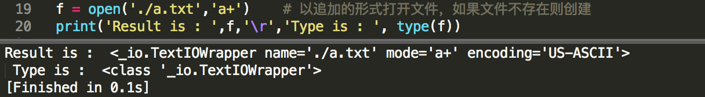
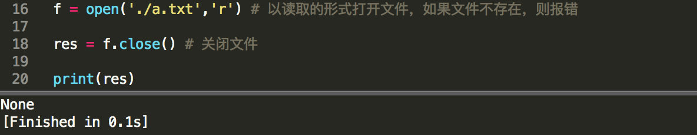
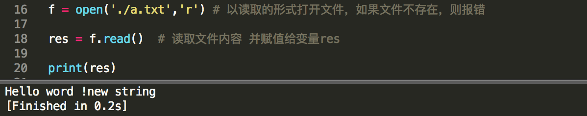

文件操作
===

---

* ## 文件操作的步骤

    1. 打开文件
    1. 对文件进行操作
    1. 关闭文件

---

* ## 文件的基本操作

    1. open()
        ```py
        功能：打开或者创建一个文件
        格式：open('文件路径','打开模式')
        返回值：文件io对象
        ```
        ```
        基础模式:( w,a,x,r )
        w:	write 	写入模式	若文件不存在,则新建. 若已经存在,打开文件并清空原有内容
        a:      append 	追加模式	若文件不存在,则新建. 若已经存在,则打开文件,则原有内容基础上添加
        x:	xor	异或模式	若文件不存在,则新建. 若已经存在,则报错
        r:	read	读取模式	可执行读取文件的相关操作

        增强模式( +,b ) 只能和基础模式配合使用 
        +:	plus	读写模式	在w,a,x 或者 r 的基础上加+,则实现读写都可的功能
        b:	byte	位模式		 在位模式下进行读或者写或者读写的操作

        组合方式:
        w:		若文件不存在,则新建文件等待写入操作. 若文件已存在,则打开文件并清空原内容,之后可以进行写入操作. 
        a:  	若文件不存在,则新建文件等待写入操作. 若文件已存在,则打开文件并清空原内容,之后可以进行写入操作.
        x: 		若文件不存在,则新建文件等待写入操作. 若文件已存在,则直接报错!
        r: 		若文件不存在,则报错! 若文件已存在,则打开文件,并可进行读取相关的操作

        w+:		若文件不存在,则新建文件等待写入操作. 若文件已经存在,则打开文件并清空内容,之后可执行写入或读取
        r+:		若文件不存在,则报错! 若文件已经存在,则打开文件,之后可执行写入操作和读取操作
        x+:		若文件不存在,则新建文件等待写入操作, 若文件已经存在,则报错!
        a+:		若文件不存在,则新建文件等待写入操作, 若文件已经存在,则打开原文件,在原文件的基础上可追加或读取

        wb:		若文件不存在,则新建文件等待写入操作.若文件已经存在,则打开文件并清空内容.所有写入需要用encode()编码
        rb:		若文件不存在,则报错! 若文件已经存在,则打开文件可进行读取操作.所有读取内容要用decode()解码
        ab:		若文件不存在,则新建文件等待写入操作,若文件已经存在,则打开文件并追加内容.所有写入需要用encode()编码
        xb:		若文件不存在,则新建文件等待写入操作,若文件已经存在,则报错!

        wb+:	若文件不存在,则新建文件且可读可写.若文件已存在,清空内容,可读可写.读要用decode()解码.写要用encode()编码
        rb+:	若文件不存在,则报错! 若文件已存在,则打开文件,可读可写.读要用decode()解码.写要用encode()编码
        ab+:	若文件不存在,则新建文件且可读可写.若文件已存在,打开原内容,追加内容.读要用decode()解码.写要用encode()编码
        xb+:	若文件不存在,则新建文件且可读可写,若文件已存在,直接报错! 读要用decode()解码.写要用encode()编码
        ```

        
        
    1. close()
        ```py
        功能：关闭文件
        格式：文件io对象.close()
        返回值：None
        ```

        

---

* ## 读写函数

    1. read()
        ```py
        功能：读取文件
        格式1：
            文件io对象.read()
            返回值：整个文件的字符

        格式2：
            文件io对象.read(字符长度)
            返回值：指定长度的字符
        ```
        
        

    1. readline()
        ```py
        功能：读取一行文件
        格式1：
            文件io对象.readline()
            返回值：一行内容的字符串

        格式2：
            文件io对象.readline（字符长度）
            返回值：一行内容的字符串

        注意：字符长度<当前行内内容，则读取指定长度的字符串，并且下次再读取还是在这个一行中获取没有读取的内容。
        字符长度>=当前行内容，直接读取当前行
        ```

        ```py
        fp = open('/Users/apple/desktop/01.txt','r')

        # 读取一行文件的内容
        content = fp.readline()  
        print(content)

        # 移动指针
        fp.seek(0)

        # 读取指定字符长度,若不满足一行则只读5个字符,若超过一行,则只读一行字符
        content = fp.readline(5) 
        print(content)

        # 关闭文件
        fp.close()
        ```

    1. readlines()
        ```py
        功能：将文件中的内容读取到序列当中。
        格式1：
            文件io对象.readlines()
            返回值：列表

        格式2：
            文件io对象.readlines(字符长度)
            返回值：列表

        注意：读取的行数由字符长度决定，如果字符长度读取了N行后，还有指定长度的字符没有读取，则直接读取下一行进来
        ```
        ```py
        # 打开文件
        fp = open.(''/Users/apple/desktop/01.txt','r')

        # 默认读取全部行
        content = fp.readlines()
        print(content)

        # 移动指针
        fp.seek(0)

        # 读取指定字符长度的行数
        content = fp.readlines(20)  # 字符长度若不足一行,则按一行算,若超过一行,则显示下一整行
        print(content)

        # 关闭文件
        fp.close()
        ```

    1. write()
        ```py
        功能：写入文件
        格式：文件io对象.write(字符串)
        返回值：写入字符串的长度
        ```

        

    1. writelines()
        ```py
        功能：将序列写入文件中
        格式：文件io对象.writelines(序列)
        返回值：None
        ```

    1. truncate()
        ```py
        功能：字符串截取操作
        格式：文件io对象.truncate(字节长度)
        返回值：截取的字节长度
        ```

---

* ## 文件指针操作

    1. tell()
        ```py
        功能：查看当前指针的位置
        格式：文件io对象.tell()
        返回值：整数
        ```

    1. seek()
        ```py
        功能：调整指针的位置
        格式1：
            文件io对象.seek(N)  将指针直接调整到N的位置，从开头计算第N个位置
            返回值：指针的位置

        格式2：
            文件io对象.seek(偏移位置，参考点方式)
            返回值：指针的位置

        参考点方式：
            0 从文件的最开头计算偏移
            1 从文件的当前指针位置开始计算偏移(实验不通)
            2 从文件末尾开始计算偏移(实验不通)
        ```

---

* ## 自定义函数获取指定行数
    
    ```py
    # 自定义函数实现读取文件中的指定行数

    def myReadLines(path,hang=-1,sep='\n'):  
    # path:要打开的文件路径  hang:显示文件内容的行数  sep:当前操作系统中默认的换行符号

        # 打开指定文件
        fp = open(path,'r')

        # 获取文件内所有内容
        content = fp.read()

        # 使用换行符号切割字符串,放入列表lists中
        #若最后一行切完是一个空字符串,则需要分片去掉最后一个 lists = content.split(sep)[0:-1]
        lists = content.split(sep) 

        # 判断用户输入的行数,并确认最终输出的总行数
        maxhang = len(lists)

        if hang < 0 or hang >= maxhang:
            hang = maxhang
        else:
            hang = int(hang)

        result = [i + sep for i in lists[:hang]]  # 用分片来控制最终的列表的长度

        # 如果要用列表的形式直接呈现,直接输入result就可以了
        #print(result)

        # 遍历最终的列表result 输出内容
        for i in result:
            print(i, end='')

    myReadLines('/Users/apple/desktop/01.txt',5)
    ```

---

## 另一种打开方式

**在文件操作中用于监控文件的使用状态，在文件不使用时自动关闭文件操作。**
```py
with open(filename, 模式) as f:
    f.write
    f.read
    ...
    等各种操作，不用手动使用close

try:
    #程序监控打开的1.txt文件
    with open('1.txt','r') as fp:
        #读取文件
        text = fp.read()
        print(text)
except:
    print('文件操作出错！')

```

---

* ## 什么是字符，字节，字符集

    * 字符
        ```py
        人们使用的记号，抽象意义上的一个符号。 '1', '中', 'a', '$', '￥', ……

        空格占一个字符；

        一个汉字占2个字符；

        一个字母占一个字符；
        ```

    * 字节 `Byte`
        ```py
        字节是通过网络传输信息（或在硬盘或内存中存储信息）的单位。

        字节是计算机信息技术用于计量存储容量和传输容量的一种计量单位，1个字节等于8位二进制。换算为十进制。最小值0，最大值255。如一个ASCII码就是一个字节。

        GB、GBK编码是1个字符占用2个字节；

        ASCII码 美国专用, 一个英文字母（不分大小写）占一个字节的空间，一个中文汉字占两个字节的空间

        UTF-8编码：一个英文字符等于一个字节，一个中文（含繁体）等于三个字节。中文标点占三个字节，英文标点占一个字节

        Unicode编码：一个英文等于两个字节，一个中文（含繁体）等于两个字节。中文标点占两个字节，英文标点占两个字节
        
        不同编码区间用来表示的字节也有不同。

        1KB = 1024B  
        1MB = 1024KB
        1GB = 1024MB
        ITB = 1024GB
        1PB = 1024TB
        ```

     字符集
        ```py
        字符就是字符的编码类型。

        ASCII码 美国专用, 一个英文字母（不分大小写）占一个字节的空间，一个中文汉字占两个字节的空间

        每种语言单独一种编码格式，为了使得计算机能够操作某种语言，中文(GB2313,GB10300,GBK,BIG5...) GBK格式中一个汉字需要2个字节表示，拼音和数字依然是一个字节

        几乎所有语言都可以使用的字符集，utf类字符集，能够表示世界上绝大多数的文字。(utf-8) utf-8字符集表示汉字需要3个字节，表示拼音和数字还是1个字节
        ```*


