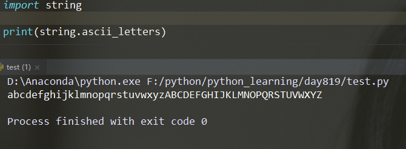

String模块
===

---

* ### ascii_letters
    ```py
    获取所有ascii码中字母字符的字符串（包含大写和小写）
    ```
    **使用**
    ```py
    import string

    print(string.ascii_letters)
    ```
    

* ### ascii_uppercase
    ```py
    获取所有ascii码中的大写英文字母
    ```

* ### ascii_lowercase
    ```py
    获取所有ascii码中的小写英文字母
    ```

* ### digits
    ```py
    获取所有的10进制数字字符
    ```

* ### octdigits
    ```py
    获取所有的8进制数字字符
    ```

* ### hexdigits
    ```py
    获取所有16进制的数字字符
    ```

* ### printable
    ```py
    获取所有可以打印的字符
    ```

* ### whitespace
    ```py
    获取所有空白字符
    ```

* ### punctuation
    ```py
    获取所有的标点符号
    ```

---

## ASCII

> 美国标准信息交换代码。 定制了128个常用字符，主要是英文，数字，标点符号及键盘中其他按键对应的整数值。

* ### python中与ascii码相关的两个函数：

    ```py
    chr()
        将ascii编码转化为字符
        格式：chr(ascii码)
        返回值：字符

    ord()
        将字符转化为对应的ascii码
        格式：ord(字符)
        返回值：ascii码
    ```

* ### 大写字母

    ```py
    A~Z      65~90
    ```

* ### 小写字母

    ```py
    a~z      97~122
    ```

* ### 数字

    ```py
    0~9      48~57
    ```


