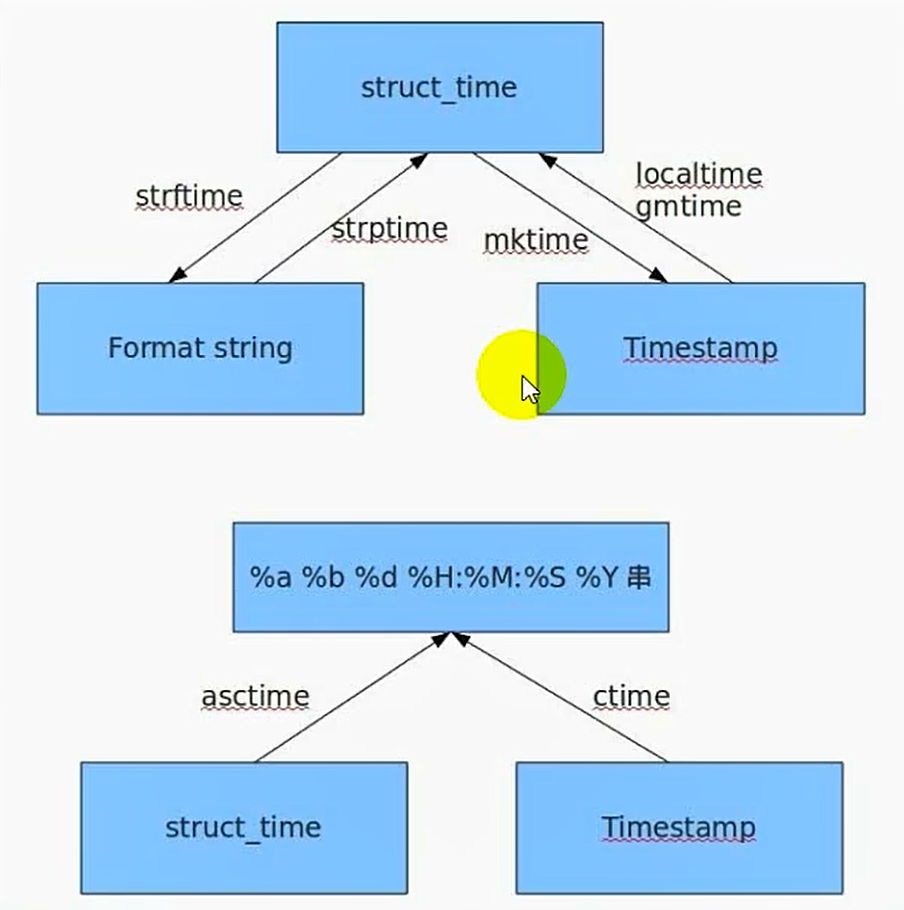

时间日期相关的模块
===

---

* **time　　　时间模块**
* **datetime　日期时间模块**
* **calendar　日历模块**

---

## time模块

> 先导入时间模块
>
> import time


---
* ### 时间戳
    ```py
    时间戳是一种用于表示时间的方式。从1970年1月1日0时0分0秒0毫秒开始到指定时间的秒数。世间戳也叫做unix时间戳，1970年1月1日成为unix元年。
    作用:是为了方便时间的统一运算。
    1.从1970年1月1日开始计算。
    2.能够使用到2038年的某一天
    3.如果使用太远的未来或者1970年以前的时间可能出现异常
    ```

* ### UTC时间
    ```py
    UTC时间又称为世界协调时间,特指格林尼治天文台所在的位置的时间,也叫格林尼治时间.
    中国的时区是东八区,比世界协调时间快了8个小时
    ```

* ### 夏令时
    ```py
    夏令时就是通过在夏季将时间调快一小时，来提醒大家早睡早起身体好，节省蜡烛！
    每天的时钟变成了25个小时，注意本质还是24个小时
    ```
    
* ### 时间元组struct_time
    ```py
    时间元组就是一个用于表示时间格式的元组数据而已，他是time模块操作时间的主要方式。

    (tm_year=2017, tm_mon=7, tm_mday=4, tm_hour=9, tm_min=4, tm_sec=21, tm_wday=1, tm_yday=185, tm_isdst=0)
    格式:（年，月，日，时，分，秒，周几，一年中的第几天，是否是夏令时）

    索引        名称          内容           取值
    0        tm_year        年           4位数年份   2017
    1        tm_month       月           1～12
    2        tm_day         日           1～31
    3        tm_hour        时           0～23 
    4        tm_min         分           0～59 
    5        tm_sec         秒           0～61  60闰秒，61是历史保留
    6        tm_wday        周几          0～6  周一～周天
    7        tm_yday        一年中的第几天  1～366
    8        tm_isdst       夏令时         0 是  其他不是
    ```

---
* ### 时间模块的值

    * #### timezone
        ```py
        功能: 获取UTC和当前时区时间戳的差值 (UTC时间戳 - 当前时区时间戳)

        import time 
        print(time.timezone)
        ```

    * #### altzone
        ```py
        功能: 在夏令时的情况下,获取UTC时间和当前时区的差值

        import time 
        print(time.altzone)
        ```
    
    * #### daylight
        ```py
        功能: 检测是否是夏令时,0 就是 夏令时  非零不是夏令时

        import time 
        print(time.daylight)
        ```

* ### 时间模块的函数

    * #### asctime() 
        ```py
        功能：返回一个正常的可读的时间字符串
        格式：time.asctime(时间元组)
        返回值：时间字符串

        import time 
        result = time.asctime((1992,2,1,21,33,44,0,0,0))
        print(result)
        ```

    * #### localtime() 
        ```py
        功能：获取当前时间元组
        格式1：time.localtime()
            返回值：本地时间元组

        格式2：time.localtime(时间戳)
            返回值:指定时间戳的本地时间元组

        import time 
        result = time.localtime()
        print(result)

        result = time.localtime(1231424)
        print(result)
        ```

    * #### gmtime() 
        ```py
        功能：获取当前UTC时间元组
        格式1：time.gmtime()
            返回值：当前UTC时间元组

        格式2：time.gmtime(时间戳)
            返回值：指定时间戳的UTC时间元组

        import time 
        result = time.gmtime()
        print(result)

        result = time.gmtime(135454426)
        print(result)
        ```

    * #### ctime() 
        ```py
        功能：获取本地时间的字符串格式
        格式1： time.ctime()
            返回值：时间格式字符串 相当于 asctime(localtime())

        格式2： time.ctime(时间戳)
            返回值：时间格式字符串 相当于asctime(localtime（时间戳）)

        import time 
        result = time.ctime()
        print(result)
        ```

    * #### mktime() 
        ```py
        功能：使用时间元组制作时间戳
        格式：time.mktime(时间元组)
        返回值: 时间戳
        注意：按照本地时间来进行计算，如果想按照UTC时间计算，则是calendar.timegm()

        import time 
        result = time.mktime((1992,2,1,23,45,22,0,0,0))
        print(result)
        ```

    * #### clock() 
        ```py
        功能：获取CPU时间，用于计算代码执行时间
        格式：time.clock()
        返回值：浮点数时间戳
        主要用于计算程序执行时间，开始获取一次，程序执行完毕在获取一次，相减获得执行总时间
        
        import time 

        starttime = time.clock()

        lists = [i *  2 for i in range(1,10000)]

        endtime = time.clock()

        ptime = endtime - starttime
        print(ptime)
        ```

    * #### perf_counter() 
        ```py
        功能：获取CPU时间用于计算时间差
        格式：time.perf_counter()
        返回值：浮点数时间戳
        主要用于计算程序执行时间，开始获取一次，程序执行完毕在获取一次，相减获得执行总时间，仅py3.3以上
        
        import time 
        
        starttime = time.perf_counter()

        time.sleep(2)

        endtime = time.perf_counter()

        ptime = endtime - starttime
        print(ptime)
        ```

    * #### sleep() 
        ```py
        功能：程序睡眠，使得程序在此处等待指定的时间
        格式：time.sleep(时间秒数)
        返回值：无
        
        import time

        time.sleep(15)

        print('有完没完了测试需要15s么!?')
        ```

    * #### strftime() 
        ```py
        功能：格式化输出时间字符串（str foramt time）
        格式：time.strftime('字符串格式'[,时间元组])
        返回值：格式化之后的哦字符串

        格式    含义        备注
        %a    本地（locale）简化星期名称
        %A    本地完整星期名称
        %b    本地简化月份名称
        %B    本地完整月份名称
        %c    本地相应的日期和时间表示
        %d    一个月中的第几天（01 - 31）
        %H    一天中的第几个小时（24 小时制，00 - 23）
        %I    一天中的第几个小时（12 小时制，01 - 12）
        %j    一年中的第几天（001 - 366）
        %m    月份（01 - 12）
        %M    分钟数（00 - 59）
        %p    本地 am 或者 pm 的相应符    注1
        %S    秒（01 - 61）    注2
        %U    一年中的星期数（00 - 53 星期天是一个星期的开始）第一个星期天之前的所有天数都放在第 0 周    注3
        %w    一个星期中的第几天（0 - 6，0 是星期天）    注3
        %W    和 %U 基本相同，不同的是 %W 以星期一为一个星期的开始
        %X    本地相应时间
        %y    去掉世纪的年份（00 - 99）
        %Y    完整的年份
        %z    用 +HHMM 或 -HHMM 表示距离格林威治的时区偏移（H 代表十进制的小时数，M 代表十进制的分钟数）
        %%    %号本身
        ```
        ```py
        # 取当前格式化时间
        import time

        res = time.strftime("%Y-%m-%d %H:%M:%S", time.localtime())
        print(res)
        ```

    * #### strptime() 
        ```py
        功能：解析时间字符串成一个元组，strftime的逆向操作（str parse time）
        格式：time.strptime('时间字符串','时间字符串格式')
        返回值：时间元组
        
        import time

        result = time.strptime('1992年2月1日,0时2分3秒','%Y年%m月%d日,%H时%M分%S秒')
        print(result)
        ```

    * #### time() 
        ```py
        功能: 获取本地的时间戳
        格式: time.time()
        返回值：时间戳
        
        import time

        result = time.strptime('1992年2月1日,0时2分3秒','%Y年%m月%d日,%H时%M分%S秒')
        print(result)
        ```
* ### 一张图说明各种时间之间的相互转换
    

    * 练习题
        
        ```py
        import time

        # 返回当前时间的时间戳，浮点数形式
        a = time.time()
        # print(a)

        # 将时间戳转为UTC时间元组
        b = time.gmtime(a)
        # print(b)

        # 将时间戳转为本地时间元组
        c = time.localtime(a)
        print(c)

        # 将本地时间元组转为时间戳
        d = time.mktime(c)
        # print(d)

        # 将时间元组转为字符串
        e = time.asctime(c)
        print(e)

        # 将时间戳转为字符串   time.asctime(time.localtime(time.time()))
        f = time.ctime(a)
        # print(f)

        # 将时间元组转换为给定格式的字符串
        # 格林尼治时间
        g1 = time.strftime("%Y-%m-%d %H:%M:%S", b)
        # 当前时间
        g2 = time.strftime("%Y-%m-%d %X", c)
        # print(g1, type(g1))
        # print(g2, type(g2))

        # 将时间字符串转为时间元组
        h = time.strptime(g1, "%Y-%m-%d %H:%M:%S")
        # print(h)

        k = time.strftime("%Y-%m-%d %H:%M:%S", time.localtime())
        # print(k)

        # 延迟一个时间，整型或者浮点型，单位是s
        # time.sleep(4)

        # 返回当前程序的cpu执行时间
        # Unix系统返回全部的运行时间
        # Windows从第二次开始，都是以第一次调用此函数的开始时间戳作为计数
        m1 = time.clock()
        # print("%d" % m1)
        # time.sleep(2)
        m2 = time.clock()
        # print("%d" % m2)
        # time.sleep(2)
        m3 = time.clock()
        # print("%d" % m3)
        ```

    * 两道题
        ```py
        # -*- coding:utf-8 -*-
        import time
        import datetime

        # 输入年月日，返回日期为这一年的第几天
        def get_time(str_time):
            return time.mktime(time.strptime(str_time, '%Y-%m-%d'))

        def count_date(year, month, day):
            base_str_time = '%s-1-1' % year
            base_time = get_time(base_str_time)
            str_time = '%s-%s-%s' % (year, month, day)
            time = get_time(str_time)
            retTime = int((time-base_time)/3600/24) + 1
            return retTime
        
        if __name__ == '__main__':
            print(count_date(1997, 6, 13))
        ```
        ```py
        # -*- coding:utf-8 -*-
        import time
        import datetime

        # 输入某一年的天数，返回年月日
        def out_date(year, day):
            # 使用datetime
            # tmp_days = datetime.datetime(year, 1, 1)
            # days = datetime.timedelta(days=day-1)
            # retTime = datetime.datetime.strftime(tmp_days+days, '%Y-%m-%d')
            # return retTime
            
            # 使用time
            time1 = (day-1)*24*3600
            base_str_time = '%s-1-1' % year
            base_time = get_time(base_str_time)
            time2 = time1 + base_time
            ret = time.strftime('%Y-%m-%d', time.localtime(time2))
            return ret

        if __name__ == '__main__':
            print(out_date(1997, 164))
        ```

---

## datetime模块

> 使用前也要先导入
>
> import datetime

* ### 简单介绍
    ```py
    datetime比time高级了不少，可以理解为datetime基于time进行了封装，提供了更为实用的函数，datetime模块的接口更直观，更容易调用
    模块中的类：
        datetime    同时有时间和日期
        timedelta   主要用于计算时间的跨度
        tzinfo      时区相关
        time        只关注时间
        date        只关注日期

    # 详细理解请进入 https://blog.csdn.net/cmzsteven/article/details/64906245
    ```

* ### 获取当前时间
    ```py
    import datetime

    d1 = datetime.datetime.now()
    print(d1, type(d1))

    2018-10-14 17:28:25.214816 <class 'datetime.datetime'>
    ```

* ### 获取指定时间
    ```py
    import datetime

    d2 = datetime.datetime(1999, 10, 1, 10, 28, 25, 123456)
    print(d2, type(d2))

    1999-10-01 10:28:25.123456 <class 'datetime.datetime'>
    ```

* ### 将时间转为字符串
    ```py
    import datetime

    d1 = datetime.datetime.now().strftime("%Y-%m-%d %X")
    print(d1)

    2018-10-14 17:32:24
    ```


* ### 将格式化字符串转为datetime对象

    ```py
    import datetime

    # 注意：转换的格式要与字符串一致
    d1 = datetime.datetime.strptime(datetime.datetime.now().strftime("%Y-%m-%d %X"), "%Y-%m-%d %X")
    print(d1, type(d1))

    2018-10-14 17:36:27 <class 'datetime.datetime'>
    ```

* ### 计算天数差

    ```py
    import datetime

    d1 = datetime.datetime(1999, 10, 1, 10, 28, 25, 123456)
    d2 = datetime.datetime.now()
    d3 = d2 - d1

    print(d3, type(d3))
    # 间隔的天数
    print(d3.days)
    # 间隔天数除外的秒数
    print(d3.seconds)

    6953 days, 7:09:06.144164 <class 'datetime.timedelta'>
    6953
    25746
    ```

---

## calendar模块

> 使用前也要先导入
>
> import datetime

* ### 日历模块函数

    * #### calendar.calendar()

        ```py
        功能：获取指定年份的日历字符串
        格式：calendar.calendar（年份, w=2, l=1, c=6, m=3）
        返回值：字符串
            w表示 2个日期之间的间隔字符长度
            l表示 一个周占用几个行高度
            c表示2个月份之间的空白间隔
            m表示一行显示几个月

        import calendar
        result = calendar.calendar(2017)
        print(result)
        ```

    * #### calendar.month()

        ```py
        功能：获取指定年月的日历字符串
        格式：calendar.month(年，月，w=2，l=1)
        返回值：字符串A

        import calendar
        result = calendar.month(2017, 10)
        print(result)
        ```

    * #### calendar.monthcalendar()

        ```py
        功能：获取一个年月的矩阵列表
        格式：calendar.monthcalendar(年, 月)
        返回值：二级列表
        [
            [0, 0, 0, 0, 0, 1, 2],
            [3, 4, 5, 6, 7, 8, 9],
            [10, 11, 12, 13, 14, 15, 16],
            [17, 18, 19, 20, 21, 22, 23],
            [24, 25, 26, 27, 28, 29, 30],
            [31, 0, 0, 0, 0, 0, 0]
        ]
        结果中0表示不是该月的数值，1-31才是当月信息

        import calendar
        result = calendar.monthcalendar(2017, 10)
        print(result)
        ```

    * #### calendar.monthrange()

        ```py
        功能：获取一个月的周几开始及当月天数
        格式：calendar.monthrange(年，月)
        返回值：元组(周几，天数)
        注意：0-6表示周一到周天

        import calendar
        result = calendar.monthrange(2017, 10)
        print(result)

        (6, 31)
        ```

    * #### calendar.isleap()

        ```py
        功能：检测指定年份是不是闰年
        格式：calendar.isleap(年份)
        返回值：布尔值

        import calendar
        result = calendar.isleap(2017)
        print(result)

        False
        ```

    * #### calendar.leapdays()

        ```py
        功能：检测指定年份之间的闰年个数
        格式：calendar.leapdays(开始年份，结束年份)
        返回值：整数
        注意：包含开始年份不包含结束年份

        import calendar
        result = calendar.leapdays(1900, 2011)
        print(result)

        27
        ```  

    * #### calendar.weekday()

        ```py
        功能：根据年月日计算周几
        格式：calendar.weekday(年，月，日)
        返回值：整型  0-6 表示周一到周天

        import calendar
        result = calendar.weekday(2017,10,13)
        print(result)

        4
        ```  

    * #### calendar.timegm()

        ```py
        功能：将时间元组转化为时间戳
        格式：calendar.timegm(时间元组)
        返回值：时间戳

        import calendar
        ttp = (2018,1,1,0,0,0,0,0,0)
        result = calendar.timegm(ttp)
        print(result)

        1514764800
        ```  