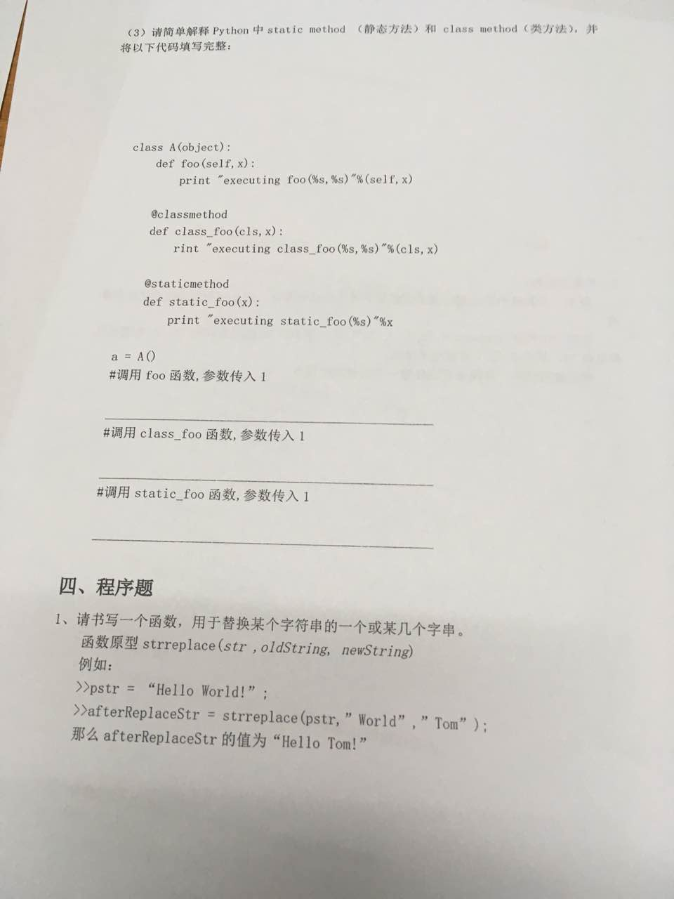

装饰器
===

---

* ### 为普通函数装饰器 

    ```py
    def adorn(func):
        def inner():
            print('人之初')
            func()
            print('性相近')
        return inner

    def hanshu():
        print('性本善')

    if __name__ == '__main__':
        hanshu = adorn(hanshu)
        hanshu()
    ```

* ### 为带有参数的函数添加装饰器

    ```py
    def adorn(func):
        def inner(who):
            func(who)
            print('性本善')
            print('性相近')

    # @是语法糖
    @adorn    
    def hanshu(who):
        print('{}说'.format(who))
        print('人之初')

    # hanshu = adorn(hanshu)	== @adorn

    if __name__ == '__main__':
        hanshu('孔子')
    ```

* ### 为带有返回值的函数添加装饰器

    ```py
    def adorn(func):
        def inner():
            result = func()
            print('性本善')
            print('性相近')
            return result
        return inner

    @adorn
    def hanshu():
        print('人之初')
        return '三斤仁义道德'

    if __name__ == '__main__':
        result = hanshu()
        print(result)
    ```

* ### 为带有返回值和形参的函数添加装饰器

    ```py
    def adorn(func):
        def inner(who):
            result = func(who)
            print('性本善')
            print('性相近')
            return result
        return inner

    @adorn
    def hanshu(who):
        print('{}说'.format(who))
        print('人之初')
        return '二两仁义道德'

    # hanshu = adorn(hanshu)

    if __name__ == '__main__':
        result = hanshu('孔子')
        print(result)
    ```

* ### 为带有搜集参数的函数添加装饰器

    ```py
    def adorn(func):
        def inner(*who):
            func(*who)
            print('然而他们说的话我记住的并不多')
            print('只知道,人之初......')
        return inner

    @adorn
    def hanshu(*who):
        string = ''
        for i in who:
            string += (i+',')
        print('{}这些人都是古代的先贤'.format(string))

    if __name__ == '__main__':
        hanshu('孔子','孟子','韩非子','荀子')
    ```

* ### 使用类作为装饰器的参数(用类的中的方法装饰函数)

    ```py
    def adorn(cls):
        def _adorn(func):
            def inner(**who):
                func(**who)
                cls.kongzi()
                cls.xunzi()
            return inner
        return _adorn

    class Perf:
        def kongzi():
            print('三人行必有我师')
        def xunzi():
            print('人之初,性本恶')

    @adorn(Perf)
    def hanshu(**who):
        string = ''
        for x,y in who.items():
            string += (y+',')
        print(string + '这些人都是古代先贤')
        print('他们说过:')

    if __name__ == '__main__':
        hanshu(kz = '孔子', xunzi = '荀子')
    ```

* ### 一个装饰器装饰多个函数

    ```py
    def adorn(flag):
        def _adorn(func):
            def inner():
                if flag == 'mxy':
                    func()
                    print('只愿北凉不悲凉')
                    print('北凉愿为天下黎民守国门!')
                elif flag == 'jxy':
                    func()
                    print('你要天下,我为你打下一座天下')
                    print('你要江湖,我给你踏平一座江湖')
                    print('我只要一个孩子')
                    print('你给不给?')
            return inner
        return _adorn

    @adorn('mxy')
    def hanshu1():
        print('mxy说过')

    @adorn('jxy')
    def hanshu2():
        print('jxy说过')

    if __name__ == '__main__':
        hanshu1()
        hanshu2()
    ```


* ### 使用类作为装饰器装饰函数

    ```py
    class Adorn:
        def __init__(self, flag):
            self.flag = flag

        def __call__(self, func):
            self.func = func
            if self.flag == 'mxy':
                return self.inner1
            elif self.flag == 'jxy':
                return self.inner2

        def inner1(self):
            self.func()
            print('如果你死了')
            print('你的尸首在哪里')
            print('我就在哪里')

        def inner2(self):
            self.func()
            print('我来接我媳妇')
            print('谁敢拦我!')

    @Adorn('mxy')
    def hanshu1():
        print('jxy说过')

    @Adorn('jxy')
    def hanshu2():
        print('mxy说过')

    if __name__ == '__main__':
        hanshu1()
        hanshu2()
    ```

* ### 使用函数作为装饰器来装饰类

    ```py
    def adorn(cls):
        def inner():
            print('给你加个功能,还要保留你实例化的功能')
            obj = cls()
            print('来我这里你出去就变成function了,难过么')
            return obj
        return inner

    @adorn
    class BeiLiang:
        def method1(self):
            print('用不上....真尴尬')
    if __name__ == '__main__':
        obj = BeiLiang()
        print(obj)
    ```

* ### 多层嵌套的装饰器

    ```py
    def adorn1(func):
        def inner():
            print('天不生我李淳罡')
            func()
            print('一剑平天下不平事')
        return inner

    def adorn2(func):
        def inner():
            print('一把木马牛,青衫仗剑独风流')
            func()
            print('一剑无愧天下有愧人')
        return inner

    @adorn2
    @adorn1
    def lichungang():
        print('剑道万古如长夜')
        
    if __name__ == '__main__':
        lichungang()
    ```

* ### 使用类作为装饰器来装饰类

    ```py
    class Adorn:
        def __init__(self,flag):
            pass

        def __call__(self,cls):
            self.cls = cls
            return self.inner

        def inner(self):
            print('我要开始实例化了')
            obj = self.cls()
            print('我已经不是类了...')
            return obj

    @Adorn('有没有都一样')
    class BeiLiang:
        name = '占位'
        def test(self):
            print('唉,用不上,单纯占位')

    if __name__ == '__main__':
        b = BeiLiang()
        print(b)
    ```


* ### 起到修饰数据的作用

    ```py
    # 可以将不规范的年龄过滤成0
    def outer(func):
        def inner(age):
            if age < 0:
                age = 0
            func(age)
        return inner

    # 使用@符号将装饰器应用到函数
    @outer      # 相当于say = outer(say)
    def say(age):
        print("meng is %d years old" % age)

    if __name__ == '__main__':
        # say = outer(say)
        say(-10)
    ```

* ### 通用装饰器

    ```py
    # -*- coding:utf-8 -*-

    def outer(func):
        def inner(*args, **kwargs):
            # 添加修饰的功能
            print("&&&&&&&&&&&&&&&&&&&&&&&&&&&&&&")
            func(*args, **kwargs)
        return inner

    @outer
    # 函数的参数理论上是无限制的，但实际上最好不好超过6-7个
    def say(name, age=28):
        print("my name is %s, I am %d years old" % (name, age))

    if __name__ == '__main__':
        say("meng", age=1)
    ```

    ```py
    # -*- coding:utf-8 -*-
    
    import time

    def foo(num):
        def outer(fun):
            def inner(*args, **kwargs):
                start_time = time.time()
                for i in range(num):
                    fun(*args, **kwargs)
                run_time = time.time() - start_time
                return run_time
            return inner
        return outer


    @foo(5)
    def func(user, name, pwd):
        for i in range(9999999):
            pass
        print(user, "say hello to", name, pwd)

    run = func("rose", "jack", 123)
    print(run)

    ```

---

# 方法的分类

* ### 绑定类方法
    ```py
    绑定类方法就是类中只能由类调用的方法,不带任何参数接收对象的方法(没有self的方法)
    class Human:
        def eat():
            print('绑定类方法,对象无法调用')
    ```

* ### 非绑定类方法 (对象方法)
    ```py
    非绑定类方法就是类中可以允许对象使用的方法,带有一个形参self来接受对象调用时默认传入的对象值
    class Human:
        def drink(self):
            print('非绑定类方法,对象可以调用')
    ```

* ### 类方法
    ```py
    类方法是在类中 通过@classmethod 进行声明, 默认在调用他的时候会将类传入方法中由cls来接收
    class Human:
        @classmethod
        def sleep(cls):
            print('类方法,默认会将类传进来由形参cls接收')
    ```

* ### 静态方法
    ```py
    静态方法是在类中,通过@staticmethod 进行声明, 定义的方法可以被类和对象任意调用,不用向静态方法中传入任何对象和类.
    class Human:
        @staticmethod
        def run():
            print('静态方法可以被对象和类随意调用,不需要传入类和对象')
    ```
* #### 类方法和静态方法试题

    

    ```py
    # 类方法默认在调用他的时候会将类传入方法中由cls来接收
    # 静态方法可以被类和对象任意调用,不用向静态方法中传入任何对象和类.

    class A(object):
        def foo(self, x):
            print('executing foo(%s, %s)' % (self, x))

        @classmethod
        def class_foo(cls, x):
            print('executing class_foo(%s, %s)' %(cls, x))

        @staticmethod
        def static_foo(x):
            print('executing static_foo(%s)' % x)

    if __name__ == '__main__':
        a = A()
        a.foo('kafka1')
        a.class_foo('kafka2')
        a.static_foo('kafka3')
    ```
