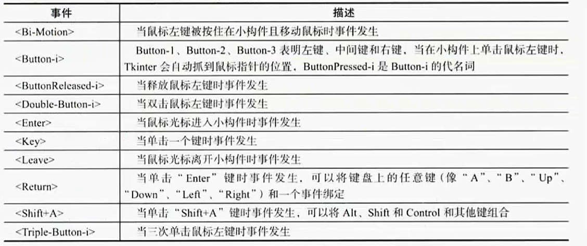
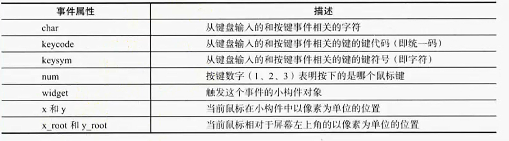

tkinter模块
===

---

* ### 基础代码

    ```py
    # -*- coding:utf-8 -*-

    import tkinter

    win = tkinter.Tk()
    win.title("大金链子小手表")
    win.geometry("400x300+200+200")

    win.mainloop()
    ```


* ### 简单示例

    ```py
    # -*- coding:utf-8 -*-

    import tkinter

    # 创建主窗口
    win = tkinter.Tk()
    # 设置标题
    win.title("大金链子小手表")
    # 设置大小和位置
    win.geometry("800x600+200+200")

    # 进入消息循环
    win.mainloop()
    ```

* ### Label控件

    ```py
    # -*- coding:utf-8 -*-

    import tkinter

    # 创建主窗口
    win = tkinter.Tk()
    # 设置标题
    win.title("大金链子小手表")
    # 设置大小和位置
    win.geometry("800x600+200+200")

    """
    Label：标签控件，可以显示文本
    win           父窗体
    text          显示的文本内容
    bg            字体颜色
    width         宽度
    height        高度
    wraplength    指定text文本中多宽进行换行
    justify       设置换行后的对齐方式
    anchor        位置：n,  ne,  e,  se,   s,  sw,   w,  nw, or center
                    北  东北  东  东南  南  西南  西  西北     居中
    """
    label = tkinter.Label(win,
                        text="高惠文景武昭宣",
                        bg='#FF7259',
                        fg="#FFFFFF",
                        font=("微软雅黑", 20),
                        width=20,
                        height=10,
                        wraplength=50,
                        justify="left",
                        anchor="center"
                        )
    # 显示出来
    label.pack()
    win.mainloop()
    ```

* ### Button控件

    ```py
    # -*- coding:utf-8 -*-

    import tkinter

    def func():
        print("meng is a good man")


    # 创建主窗口
    win = tkinter.Tk()
    # 设置标题
    win.title("大金链子小手表")
    # 设置大小和位置
    win.geometry("800x600+200+200")

    # 创建按钮
    button1 = tkinter.Button(win,
                            text="一天三顿小烧烤",
                            command=func,
                            width=15,
                            height=2,)
    button1.pack()

    button2 = tkinter.Button(win,
                            text="大金链子小手表",
                            command=lambda: print('meng is a nice man'),
                            width=15,
                            height=2,)
    button2.pack()

    button3 = tkinter.Button(win,
                            text="退出",
                            command=win.quit,
                            width=15,
                            height=2, )
    button3.pack()


    win.mainloop()
    ```

* ### Entry控件

    ```py
    # -*- coding:utf-8 -*-

    import tkinter

    # 创建主窗口
    win = tkinter.Tk()
    # 设置标题
    win.title("大金链子小手表")
    # 设置大小和位置
    win.geometry("800x600+200+200")

    """
    输入控件
    用于显示简单的文本内容
    show：show="*"        密文显示

    """
    # 绑定变量
    e = tkinter.Variable()

    entry = tkinter.Entry(win,
                        # show="*"
                        textvariable=e,
                        width=30,

                        )
    entry.pack()
    # e就代表输入框这个对象
    # 设置值
    e.set("meng is a nice man")
    # 取值
    print(e.get())
    print(entry.get())

    win.mainloop()
    ```


* ### 点击按钮输出输入框中的内容

    ```py
    # -*- coding:utf-8 -*-

    import tkinter

    # 创建主窗口
    win = tkinter.Tk()
    # 设置标题
    win.title("大金链子小手表")
    # 设置大小和位置
    win.geometry("800x600+200+200")

    def showInfo():
        print(entry.get())

    entry = tkinter.Entry(win)
    entry.pack()

    button = tkinter.Button(win, text="按钮", command=showInfo)
    button.pack()

    win.mainloop()
    ```


* ### Text控件

    ```py
    # -*- coding:utf-8 -*-

    import tkinter

    # 创建主窗口
    win = tkinter.Tk()
    # 设置标题
    win.title("大金链子小手表")
    # 设置大小和位置
    win.geometry("800x600+200+200")

    """
    文本控件，用于显示多行文本
    # height        显示的行数
    """
    text = tkinter.Text(win,
                        width=30,
                        height=10,
                        font=("微软雅黑", 15),
                        )
    text.pack()
    str = 'jio hdasi ohdas oihosi hfasoih oidoias hoish aoh isod hoiashd oihoih asdh osaihd oasih sd sdzc sad zxc sad hashdga jszh chzxkjn kjashd acxzncjkjk c xbx sz asjbiasb jkzxb bsa buiabcxzbc zxh chxzbc uzv ciabs uvdsoXZB'
    text.insert(tkinter.INSERT, str)

    win.mainloop()
    ```

* ### 带滚动条的text

    ```py
    # -*- coding:utf-8 -*-

    import tkinter

    # 创建主窗口
    win = tkinter.Tk()
    # 设置标题
    win.title("大金链子小手表")
    # 设置大小和位置
    # win.geometry("800x600+200+200")

    """
    文本控件，用于显示多行文本
    # height        显示的行数
    """
    # 创建滚动条
    scroll = tkinter.Scrollbar()

    text = tkinter.Text(win,
                        width=30,
                        height=8,
                        font=("微软雅黑", 15),)
    # side放到窗体的哪一侧  fill填充
    scroll.pack(side=tkinter.RIGHT, fill=tkinter.Y)
    text.pack(side=tkinter.LEFT, fill=tkinter.Y)
    # 关联
    scroll.config(command=text.yview)
    text.config(yscrollcommand=scroll.set)

    str = 'jio hdasi ohdas oihosi hfasoih oidoias hoish aoh isod hoiashd oihoih asdh osaihd oasih sd sdzc sad zxc sad hashdga jszh chzxkjn kjashd acxzncjkjk c xbx sz asjbiasb jkzxb bsa buiabcxzbc zxh chxzbc uzv ciabs uvdsoXZB sdsajkk asch jkoiaa u nxci nudd niu uxci oxcn uxc ncxon xco noxcn lkcxn cnx lnxc nzlknzx bihpz aigcui oixosnoi oi nxzoi xz[oi pxzi o[ixzho[xi [oizxh [oixzo[ixzho [hxz[oih ioxzh jxz jk czx cohzxoc ha c z;xn ckjzxcjasb cjbxvjxcl kvbkjs;h sn njvbnvosn u[baiosoif sjd[oifh [asohucv [von a[jdgnao i jkcvn jna diufbuoabi[os ofdo hvn jkxnpbibiu jxnv jcnvijbx[uzf haso hgaodfhg oiahg adfhg fdahg u[fdahg uadhg uafhdg ufdh'
    text.insert(tkinter.INSERT, str)

    win.mainloop()
    ```

* ### CheckButton多选框控件

    ```py
    # -*- coding:utf-8 -*-

    import tkinter

    win = tkinter.Tk()
    win.title("大金链子小手表")
    win.geometry("800x600+200+200")

    def update():
        message = ""
        if hobby1.get() == True:
            message += "money\n"
        if hobby2.get() == True:
            message += "power\n"
        if hobby3.get() == True:
            message += "people\n"
        # 清除text中的所有内容
        text.delete(0.0, tkinter.END)
        text.insert(tkinter.INSERT, message)

    # 要绑定的变量
    hobby1 = tkinter.BooleanVar()
    check1 = tkinter.Checkbutton(win,
                                text="money",
                                variable=hobby1,
                                command=update,)
    check1.pack()
    hobby2 = tkinter.BooleanVar()
    check2 = tkinter.Checkbutton(win,
                                text="power",
                                variable=hobby2,
                                command=update,
                                )
    check2.pack()
    hobby3 = tkinter.BooleanVar()
    check3 = tkinter.Checkbutton(win,
                                text="people",
                                variable=hobby3,
                                command=update,
                                )
    check3.pack()

    text = tkinter.Text(win, width=50, height=5)
    text.pack()

    win.mainloop()
    ```

* ### Radiobutton单选框控件

    ```py
    # -*- coding:utf-8 -*-

    import tkinter

    win = tkinter.Tk()
    win.title("大金链子小手表")
    win.geometry("800x600+200+200")

    def update():
        print(r.get())

    # 一组单选框要绑定同一个变量
    r = tkinter.IntVar()
    radio1 = tkinter.Radiobutton(win, text="one", value=1, variable=r, command=update)
    radio1.pack()
    radio2 = tkinter.Radiobutton(win, text="tow", value=2, variable=r, command=update)
    radio2.pack()

    win.mainloop()
    ```

* ### Listbox控件

    ```py
    # -*- coding:utf-8 -*-

    import tkinter

    win = tkinter.Tk()
    win.title("大金链子小手表")
    win.geometry("800x600+200+200")

    """
    列表框控件，可以包含一个或者多个文本框
    作用：在listbox控件的小窗口显示一个字符串
    """
    # 1、创建一个listbox，添加几个元素
    lb = tkinter.Listbox(win, selectmode=tkinter.BROWSE)
    lb.pack()

    for item in ["good", "nice", "handsome", "vg", "vn"]:
        # 按顺序添加
        lb.insert(tkinter.END, item)
    # 在开始添加
    lb.insert(tkinter.ACTIVE, "cool")
    # 将列表当成一个元素添加的
    # lb.insert(tkinter.END, ["very good", "very nice"])

    # 删除，参数1为开始的索引,参数2位结束的索引，如果不指定参数2，只删除第一个索引处的内容
    # lb.delete(1, 3)
    # lb.delete(1)

    # 选中，参数1为开始的索引,参数2位结束的索引，如果不指定参数2，只选中第一个索引处的内容
    lb.select_set(2, 5)
    # lb.select_set(2)
    # 取消选中
    # lb.select_clear(2, 4)
    # lb.select_clear(3)

    # 获取到列表中元素的个数
    # print(lb.size())
    # 从列表中取值，参数1为开始的索引,参数2位结束的索引，如果不指定参数2，只删除第一个索引处的内容
    # print(lb.get(2, 4))
    # print(lb.get(2))

    # 返回当前选中元素的索引项，不是item元素
    print(lb.curselection())

    # 判断一个选项是否被选中
    print(lb.selection_includes(1))
    print(lb.selection_includes(3))

    win.mainloop()
    ```

* ### Listbox控件(中)

    ```py
    # -*- coding:utf-8 -*-

    import tkinter

    win = tkinter.Tk()
    win.title("大金链子小手表")
    win.geometry("800x600+200+200")

    # 绑定变量
    lbv = tkinter.StringVar()

    # 于BROWSE相似，但是不支持鼠标按下后移动选中位置
    lb = tkinter.Listbox(win, selectmode=tkinter.SINGLE, listvariable=lbv)
    lb.pack()

    for item in ["good", "nice", "handsome", "vg", "vn"]:
        # 按顺序添加
        lb.insert(tkinter.END, item)
    # 在开始添加
    lb.insert(tkinter.ACTIVE, "cool")

    # 打印当前列表中的选项
    print(lbv.get())

    # 设置选项
    # lbv.set(("1", "2", "3"))

    # 绑定事件
    def myPrint(event):
        print(lb.get(lb.curselection()))
    lb.bind("<Double-Button-1>", myPrint)

    win.mainloop()
    ```

* ### Listbox控件(中下)

    ```py
    # -*- coding:utf-8 -*-

    import tkinter

    win = tkinter.Tk()
    win.title("大金链子小手表")
    # win.geometry("800x600+200+200")

    # EXTENDED，可以使listbox支持shift和control
    lb = tkinter.Listbox(win, selectmode=tkinter.EXTENDED)

    for item in ["good", "nice", "handsome", "vg", "vn", "good1", "nice1", "handsome1", "vg1", "vn1", "good2", "nice2", "handsome2", "vg2", "vn2"]:
        # 按顺序添加
        lb.insert(tkinter.END, item)

    # 按住shift，可以实现连选
    # 按住control，可以实现多选

    # 滚动条
    sc = tkinter.Scrollbar(win)
    sc.pack(side=tkinter.RIGHT, fill=tkinter.Y)
    lb.configure(yscrollcommand=sc.set)
    lb.pack(side=tkinter.LEFT, fill=tkinter.BOTH)
    sc['command'] = lb.yview

    win.mainloop()
    ```

* ### Listbox控件(下)

    ```py
    # -*- coding:utf-8 -*-

    import tkinter

    win = tkinter.Tk()
    win.title("大金链子小手表")
    win.geometry("800x600+200+200")

    # MULTIPLE，支持多选
    lb = tkinter.Listbox(win, selectmode=tkinter.MULTIPLE)
    lb.pack()
    for item in ["good", "nice", "handsome", "vg", "vn", "good1", "nice1", "handsome1", "vg1", "vn1", "good2", "nice2", "handsome2", "vg2", "vn2"]:
        # 按顺序添加
        lb.insert(tkinter.END, item)

    win.mainloop()
    ```

* ### Scale控件

    ```py
    # -*- coding:utf-8 -*-

    import tkinter

    win = tkinter.Tk()
    win.title("大金链子小手表")
    win.geometry("800x600+200+200")

    """
    供用户通过拖拽指示器改变变量的值，可以水平，也可以竖直
    tkinter.HORIZONTAL      水平
    tkinter.VERTICAL        竖直
    length                  水平时表示宽度，竖直时表示高度
    tickinterval            选择值将会为该值的倍数

    """

    scale = tkinter.Scale(win, from_=0, to=100, orient=tkinter.HORIZONTAL, tickinterval=10, length=400)
    scale.pack()

    # 设置值
    scale.set(20)

    # 取值
    def showNum():
        print(scale.get())

    tkinter.Button(win, text="按钮", command=showNum).pack()

    win.mainloop()
    ```

* ### Spinbox控件

    ```py
    # -*- coding:utf-8 -*-

    import tkinter

    win = tkinter.Tk()
    win.title("大金链子小手表")
    win.geometry("800x600+200+200")

    """
    数值范围控件
    increment       步长，默认为1
    values          最好不要与from_=0, to=100, increment=2同时使用
    """
    def update():
        print(v.get())

    # 绑定个变量
    v = tkinter.StringVar()

    # sp = tkinter.Spinbox(win, value=(0, 2, 4, 6, 8))
    # command       只要值改变就会执行对应的方法
    sp = tkinter.Spinbox(win, from_=0, to=100, increment=2, textvariable=v, command=update)
    sp.pack()

    # 设置值
    v.set(20)
    # 取值
    print(v.get())

    win.mainloop()
    ```

* ### Menu顶层菜单

    ```py
    # -*- coding:utf-8 -*-

    import tkinter

    win = tkinter.Tk()
    win.title("大金链子小手表")
    win.geometry("400x300+200+200")

    # 菜单条
    menubar = tkinter.Menu(win)
    win.config(menu=menubar)

    def func():
        print("meng is a nice man")

    # 创建一个菜单选项
    menu1 = tkinter.Menu(menubar, tearoff=False)
    # 给菜单选项添加内容
    for item in ["Python", "C", "C++", "OC", "Swift", "C#", "shell", "Java", "JS", "PHP", "汇编", "NodeJS", "退出"]:
        if item == "退出":
            # 添加分隔线
            menu1.add_separator()
            menu1.add_command(label=item, command=win.quit)
        else:
            menu1.add_command(label=item, command=func)

    # 向菜单条上添加菜单选项
    menubar.add_cascade(label="语言", menu=menu1)

    menu2 = tkinter.Menu(menubar, tearoff=False)
    menu2.add_command(label="red")
    menu2.add_command(label="blue")
    menubar.add_cascade(label="颜色", menu=menu2)

    win.mainloop()
    ```

* ### Menu鼠标右键菜单

    ```py
    # -*- coding:utf-8 -*-

    import tkinter

    win = tkinter.Tk()
    win.title("大金链子小手表")
    win.geometry("800x600+200+200")

    # 菜单条
    menubar = tkinter.Menu(win)

    # 菜单
    menu1 = tkinter.Menu(menubar, tearoff=False)
    for item in ["Python", "C", "C++", "OC", "Swift", "C#", "shell", "Java", "JS", "PHP", "汇编", "NodeJS", "退出"]:
        menu1.add_command(label=item)

    menubar.add_cascade(label="语言", menu=menu1)

    def showMenu(event):
        menubar.post(event.x_root, event.y_root )

    win.bind("<Button-3>", showMenu)

    win.mainloop()
    ```

* ### Combobox下拉控件

    ```py
    # -*- coding:utf-8 -*-

    import tkinter
    from tkinter import ttk

    win = tkinter.Tk()
    win.title("大金链子小手表")
    win.geometry("400x300+200+200")

    # 绑定变量
    cv = tkinter.StringVar()
    com = ttk.Combobox(win, textvariable=cv)
    com.pack()
    # 设置下拉数据
    com["value"] = ("黑龙江", "吉林", "辽宁")

    # 设置默认值，根据元组索引来设置
    com.current(0)

    # 绑定事件
    def func(event):
        print(com.get())
        print(cv.get())
        print("meng is a nice man")

    com.bind("<<ComboboxSelected>>", func)

    win.mainloop()
    ```

* ### Frame控件

    ```py
    # -*- coding:utf-8 -*-

    import tkinter

    win = tkinter.Tk()
    win.title("大金链子小手表")
    win.geometry("400x300+200+200")

    """
    框架控件
    在屏幕上显示一个矩形区域，多作为容器控件
    """

    frm = tkinter.Frame(win)
    frm.pack()

    # left
    frm_l = tkinter.Frame(win)
    tkinter.Label(frm_l, text="左上", bg="#FF7259", font=("微软雅黑", 20)).pack(side=tkinter.TOP)
    tkinter.Label(frm_l, text="左下", bg="#ADB0B6", font=("微软雅黑", 20)).pack(side=tkinter.TOP)
    frm_l.pack(side=tkinter.LEFT)
    # right
    frm_r = tkinter.Frame(win)
    tkinter.Label(frm_r, text="右上", bg="#37ACA6", font=("微软雅黑", 20)).pack(side=tkinter.TOP)
    tkinter.Label(frm_r, text="右下", bg="#EB5350", font=("微软雅黑", 20)).pack(side=tkinter.TOP)
    frm_r.pack(side=tkinter.RIGHT)

    win.mainloop()
    ```

* ### 表格数据

    ```py
    # -*- coding:utf-8 -*-

    import tkinter
    from tkinter import ttk

    win = tkinter.Tk()
    win.title("大金链子小手表")
    win.geometry("600x400+200+200")

    # 表格
    tree = ttk.Treeview(win)
    tree.pack()
    # 定义列
    tree["columns"] = ("姓名", "年龄", "身高", "体重")
    # 设置列，列还不显示
    tree.column("姓名", width=100)
    tree.column("年龄", width=100)
    tree.column("身高", width=100)
    tree.column("体重", width=100)

    # 设置表头
    tree.heading("姓名", text="姓名-name")
    tree.heading("年龄", text="年龄-age")
    tree.heading("身高", text="身高-height")
    tree.heading("体重", text="体重-weight")

    # 添加数据
    tree.insert("", 0, text="line1", values=("孟宪岳", "24", "180", "135"))
    tree.insert("", 1, text="line2", values=("焦致远", "25", "180", "150"))

    win.mainloop()
    ```

* ### 树状结构

    ```py
    # -*- coding:utf-8 -*-

    import tkinter
    from tkinter import ttk

    win = tkinter.Tk()
    win.title("大金链子小手表")
    win.geometry("400x300+200+200")


    tree = ttk.Treeview(win)
    tree.pack()

    # 添加一级树枝
    treeF1 = tree.insert("", 0, "中国", text="中国CHI", values=("F1"))
    treeF2 = tree.insert("", 1, "美国", text="美国USA", values=("F2"))
    treeF3 = tree.insert("", 2, "用过", text="英国UK", values=("F3"))

    # 添加二级树枝
    treeF1_1 = tree.insert(treeF1, 0, "黑龙江", text="中国黑龙江", values=("F1_1"))
    treeF1_2 = tree.insert(treeF1, 1, "吉林", text="中国吉林", values=("F1_2"))
    treeF1_3 = tree.insert(treeF1, 2, "辽宁", text="中国辽宁", values=("F1_3"))

    treeF2_1 = tree.insert(treeF2, 0, "纽约", text="美国纽约", values=("F1_1"))
    treeF2_2 = tree.insert(treeF2, 1, "旧金山", text="美国旧金山", values=("F1_2"))
    treeF2_3 = tree.insert(treeF2, 2, "洛杉矶", text="美国洛杉矶", values=("F1_3"))

    # 三级树枝
    treeF1_1_1 = tree.insert(treeF1_1, 0, "哈尔滨", text="黑龙江哈尔滨")
    treeF1_1_2 = tree.insert(treeF1_1, 1, "五常", text="黑龙江五常")

    win.mainloop()
    ```

* ### 绝对布局

    ```py
    # -*- coding:utf-8 -*-

    import tkinter

    win = tkinter.Tk()
    win.title("大金链子小手表")
    win.geometry("400x300+200+200")

    label1 = tkinter.Label(win, text="good", bg="blue")
    label2 = tkinter.Label(win, text="nice", bg="red")
    label3 = tkinter.Label(win, text="cool", bg="pink")

    # 绝对布局，窗口的变化对位置没有影响
    label1.place(x=10, y=10)
    label2.place(x=50, y=50)
    label3.place(x=100, y=100)

    win.mainloop()
    ```

* ### 相对布局

    ```py
    # -*- coding:utf-8 -*-

    import tkinter

    win = tkinter.Tk()
    win.title("大金链子小手表")
    win.geometry("400x300+200+200")

    label1 = tkinter.Label(win, text="good", bg="blue")
    label2 = tkinter.Label(win, text="nice", bg="red")
    label3 = tkinter.Label(win, text="cool", bg="pink")

    # 相对布局，窗体改变对控件有影响
    # tkinter.BOTH
    # label1.pack(fill=tkinter.Y, side=tkinter.LEFT)
    label1.pack(fill=tkinter.Y, side=tkinter.LEFT)
    # label2.pack(fill=tkinter.X, side=tkinter.TOP)
    # label3.pack(fill=tkinter.Y, side=tkinter.RIGHT)

    win.mainloop()
    ```

* ### 表格布局

    ```py
    # -*- coding:utf-8 -*-

    import tkinter

    win = tkinter.Tk()
    win.title("大金链子小手表")
    win.geometry("400x300+200+200")

    label1 = tkinter.Label(win, text="good", bg="blue")
    label2 = tkinter.Label(win, text="nice", bg="red")
    label3 = tkinter.Label(win, text="cool", bg="pink")
    label4 = tkinter.Label(win, text="handsome", bg="yellow")

    # 表格布局
    label1.grid(row=0, column=0)
    label2.grid(row=0, column=1)
    label3.grid(row=1, column=0)
    label4.grid(row=1, column=1)

    win.mainloop()
    ```

* ### 鼠标点击事件

    ```py
    # -*- coding:utf-8 -*-

    import tkinter

    win = tkinter.Tk()
    win.title("大金链子小手表")
    win.geometry("400x300+200+200")

    """
    <Button-1>          鼠标左键
    <Button-2>          鼠标滑轮
    <Button-3>          鼠标右键
    <Double-Button-1>   鼠标左键双击
    <Double-Button-2>   鼠标滑轮双击
    <Double-Button-3>   鼠标右键双击
    <Triple-Button-1>   鼠标左键三击
    <Triple-Button-2>   鼠标滑轮三击
    <Triple-Button-3>   鼠标右键三击
    """

    def func(event):
        print(event.x, event.y)

    button1 = tkinter.Button(win, text="leftmouse button")
    # button1 = tkinter.Label(win, text="leftmouse button")
    # bind，给控件绑定事件，参数1是绑定的事件，参数二是触发的事件所对应执行的函数
    # button1.bind("<Button-1>", func)
    # button1.bind("<Double-Button-1>", func)
    button1.bind("<Button-1>", func)
    button1.pack()

    win.mainloop()
    ```

* ### 鼠标移动事件

    ```py
    # -*- coding:utf-8 -*-

    import tkinter

    win = tkinter.Tk()
    win.title("大金链子小手表")
    win.geometry("400x300+200+200")

    """
    <B1-Motion>         表示左键（按住）移动
    <B2-Motion>         表示滑轮（按住）移动
    <B3-Motion>         表示右键（按住）移动
    """

    label = tkinter.Label(win, text="meng is a nice man")
    label.pack()

    def func(event):
        print(event.x, event.y)

    label.bind("<B2-Motion>", func)

    win.mainloop()
    ```

* ### 鼠标释放事件

    ```py
    # -*- coding:utf-8 -*-

    import tkinter

    win = tkinter.Tk()
    win.title("大金链子小手表")
    win.geometry("400x300+200+200")

    """
    <ButtonReleased-1>      当释放鼠标左键时事件发生
    <ButtonReleased-2>      当释放鼠标滑轮时事件发生
    <ButtonReleased-3>      当释放鼠标右键时事件发生
    """

    label = tkinter.Label(win, text="meng is a nice man", bg="red")
    label.pack()

    def func(event):
        print(event.x, event.y)

    label.bind("<ButtonRelease-1>", func)

    win.mainloop()
    ```

* ### 鼠标进入离开事件

    ```py
    # -*- coding:utf-8 -*-

    import tkinter

    win = tkinter.Tk()
    win.title("大金链子小手表")
    win.geometry("400x300+200+200")

    """
    Enter       当鼠标光标进入控件内触发
    Leave       当鼠标光标进入控件内触发
    """

    label = tkinter.Label(win, text="meng is a nice man", bg="red")
    label.pack()

    def func(event):
        print(event.x, event.y)

    # label.bind("<Enter>", func)
    label.bind("<Leave>", func)

    win.mainloop()
    ```

* ### 响应所有的按键事件

    ```py
    # -*- coding:utf-8 -*-

    import tkinter

    win = tkinter.Tk()
    win.title("大金链子小手表")
    win.geometry("400x300+200+200")

    # <Key>     相应所有的按键
    """
    label = tkinter.Label(win, text="meng is a nice man", bg="red")
    # 设置焦点
    label.focus_set()
    label.pack()

    def func(event):
        print("event.char = ", event.char)
        print("event.keycode = ", event.keycode)

    label.bind("<Key>", func)
    """

    def func(event):
        print("event.char = ", event.char)
        print("event.keycode = ", event.keycode)
    win.bind("<Key>", func)

    win.mainloop()
    ```

* ### 响应特殊按键事件

    ```py
    # -*- coding:utf-8 -*-

    import tkinter

    win = tkinter.Tk()
    win.title("大金链子小手表")
    win.geometry("400x300+200+200")

    # <Shift_L>     左Shift
    # <Shift_R>     右Shift
    # <F5>          F5键
    # <Return>      回车键
    # <BackSpace>   退格键

    label = tkinter.Label(win, text="meng is a nice man", bg="red")
    # 设置焦点
    label.focus_set()
    label.pack()

    def func(event):
        print("event.char = ", event.char)
        print("event.keycode = ", event.keycode)

    label.bind("<BackSpace>", func)

    win.mainloop()
    ```

* ### 指定按键事件

    ```py
    # -*- coding:utf-8 -*-

    import tkinter

    win = tkinter.Tk()
    win.title("大金链子小手表")
    win.geometry("400x300+200+200")

    def func(event):
        print("event.char = ", event.char)
        print("event.keycode = ", event.keycode)

    # 指定按a才能响应
    win.bind("<a>", func)

    win.mainloop()
    ```

* ### 组合按键事件

    ```py
    # -*- coding:utf-8 -*-

    import tkinter

    win = tkinter.Tk()
    win.title("大金链子小手表")
    win.geometry("400x300+200+200")

    """
    <Control-Alt-a>
    <Shift-Up>
    <Control-p>
    """

    def func(event):
        print("event.char = ", event.char)
        print("event.keycode = ", event.keycode)

    # 指定组合按键响应
    # win.bind("<Control-Alt-a>", func)
    win.bind("<Shift-Up>", func)

    win.mainloop()
    ```

---

* # 鼠标点击事件


* # 点击产生时间属性


